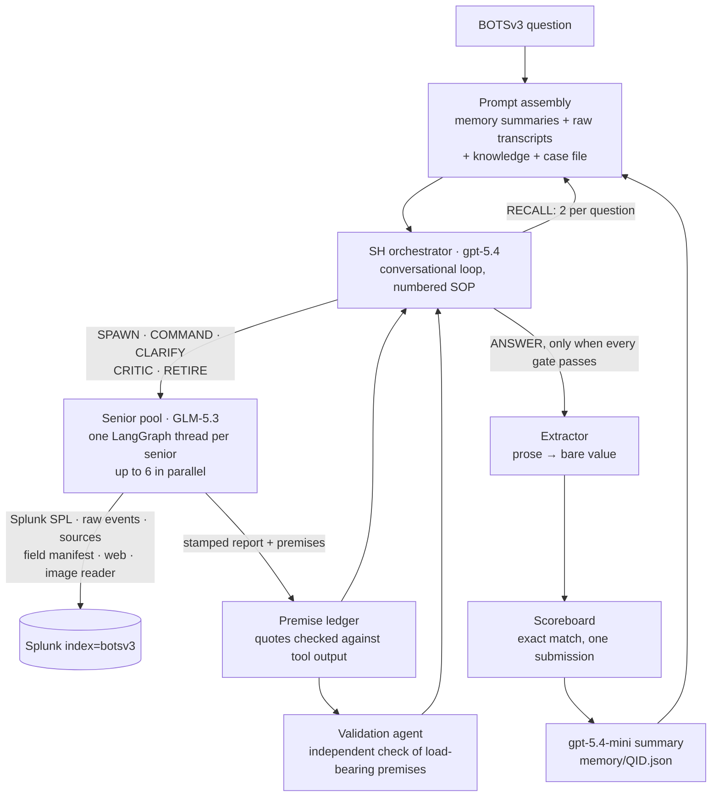

# SIEM Automation

A multi-agent LLM system that investigates realistic SOC incidents in Splunk, benchmarked on Boss of the SOC v3 (56 exact-match forensic questions), with every trajectory logged. Best complete run: **26/56 (46.4%)**. Latest run (v1.4.5): **24 correct of the 50 questions it reached**; the run was stopped before the last six 1000-point questions.

[](https://github.com/lee1613/SIEM-Automation/actions/workflows/ci.yml)
-blue)


**Live demo:** [siem-automation.streamlit.app](https://siem-automation.streamlit.app/) replays real trajectories tier by tier (Problem → Architecture → Trajectory → Score), with no setup needed.

## What this is

This repository is an agent-engineering benchmark built around 56 real forensic questions over a multi-sourcetype Splunk index. An orchestrator plans each investigation and delegates searches to worker agents that run SPL. It checks their evidence against the tool output before it lets an answer through, and submits exact-match answers to a scoreboard. SIEM is the proving ground; the project is about observable, grounded agent control under tool, context and cost constraints.

## Leaderboard

Complete full runs, generated from `log/v1/run_1.N`:

<!-- LEADERBOARD:START -->
| Tier | Solved / Total | Rate |
|------|:---:|:---:|
| 100 pt | 15 / 24 | 62.5% |
| 500 pt | 9 / 23 | 39.1% |
| 1000 pt | 2 / 9 | 22.2% |
| **Overall** | **26 / 56** | **46.4%** — 8000 / 22900 pts |

| Version | Correct | Points | Cost | Notes |
|---|:---:|:---:|:---:|---|
| v0 | 20 / 56 | 5700 | $7.73 | single agent |
| v1.0 | 20 / 58 | 5650 | $7.36 | SH + Senior pool |
| v1.1 | 26 / 56 | 8300 | $0.63 | + Junior tier, cheaper Senior model |
| v1.2 | 26 / 56 | 8000 | $31.36 | + grounding guard, structured findings |
<!-- LEADERBOARD:END -->

Regenerate with `python3 scripts/run_eval.py --write`. CI fails if this table drifts from `log/v1/`. The v1.4.5 run below is not in the table because it did not complete.

## Current performance: v1.4.5 (2026-09-24 to 2026-09-25)

| Metric | Value |
|---|---|
| Questions recorded | 50 / 56 (stopped by the operator; Q328–Q333 not recorded) |
| Correct | **24 / 50** (48%): 100 pt 14/24, 500 pt 9/23, 1000 pt 1/3 |
| Points | **6,900** of the 16,900 recorded (22,900 in the dataset) |
| Cost (recorded) | **$44.95**: SH (gpt-5.4) $18.05, seniors (GLM-5.3) $26.30, memory summarizer (gpt-5.4-mini) $0.60 |
| Latency | 11.3 h summed question time; mean 13.5 min per question (100 pt 8.4 min, 500 pt 19.6 min) |

Why the 26 wrong answers failed (root cause for every question: [result doc](docs/scoreboard_result/v1/v1.4.5.md)):

| Cause | Questions | Points lost |
|---|:---:|--:|
| Held the right answer and never submitted it: the premise gates and the turn budget ran out first | 7 | 2,700 |
| An earlier question's wrong or unsettled conclusion was carried into a later one | 6 | 2,200 |
| Never found the right evidence (wrong host or wrong phase of the attack) | 7 | 2,300 |
| Right evidence, wrong value (off-by-one, ordering semantics, format, image read) | 4 | 2,600 |
| Answer only exists on the web (Symantec pages) | 2 | 200 |

The run also exposed four reliability faults, all fixed in the v1.5.0 design:
- A senior's context grew past its window inside a round, and the provider stalled and then returned 502s.
- One brief network drop made SH give up on a question.
- A Windows file lock crashed the runner.
- A stalled call could hang for 8–20 minutes before it failed.

## Architecture (v1.4.5)



- **SH (the orchestrator).** It runs one conversation per question. Each turn chooses routes: spawn a senior, command it, ask it to clarify, critique it, retire it, recall memory, or answer. Budgets scale with value: a 1000-point question gets 3 seniors, 8 rounds each and 28 SH turns; a 100-point question gets 1 senior, 3 rounds and 5 turns.
- **Runner-enforced gates.** The runner rejects a turn that breaks a numbered SOP step and tells SH which step it broke. For example: F2 blocks ANSWER while a load-bearing premise is unverified, C3 lets a premise be stamped once, and B7 allows at most 2 RECALLs per question.
- **Seniors.** Each senior works on its own thread for up to 10 tool calls per round. It files findings through `submit_finding`, and each report is stamped with its round and the SPL it ran.
- **Premise ledger.** Premises carry quotes that must appear in output the senior's tools really returned. A validation agent re-checks load-bearing premises, so a senior can't certify its own claims.
- **Case file.** Entities and findings carried across questions.

See [the architecture docs](docs/version_architecture/v1/) for each version's design and changelog.

## Context management pipeline

A full run is 56 questions of continuous investigation, far more than any model's window. There are three layers:

1. **SH memory across questions (v1.4.5).** Each finished question is summarized by gpt-5.4-mini into a digest: the question's flow, the derivation, entities, feed facts, the SPL that worked, and what was ruled out.
   - Raw transcripts stay in the prompt until it reaches **163,200 tokens** (60% of gpt-5.4's 272K). Then the oldest are swapped for their summaries, down to 75% of that threshold, so the swap doesn't recur every question.
   - Stable blocks come first, so the provider's prompt cache stays warm.
   - A 6K-token knowledge block merges entities, feed facts and working SPL across questions.
   - RECALL fetches a summarized question's details (at most 8K tokens, twice per question).
   - Measured on v1.4.5: 6 swaps, 43 of 50 questions summarized, SH prompts held between 115K and 175K.
2. **Senior context.** Each senior's thread is compacted at 80% of GLM-5.3's 256K window. In v1.4.5 this was checked only between rounds, and it never fired. v1.5.0 moves the check to every call (below).
3. **Tool output limits.** Search results are capped at 12,000 characters, clipping long values before dropping rows. Raw events are capped at 20 per call. Images are decoded by a separate vision tool, so base64 never enters a senior's context.

## Resumable architecture

Runs take many hours and call three providers, so every stage can be killed and resumed:

- **Resume from the last turn.** After every SH turn, `resume_state/<QID>/snapshot.pkl` stores SH's messages, the premise ledger, the gate state and every senior's exported thread. `run_all_v1.py --run-name <run>` restarts a question at its last completed turn.
- **Resume across questions.** `sh_history.pkl`, `memory/*.json`, `memory/swapped.json`, `case_file.json`, `metrics.json` and `run_summary.json` are written after each question. A resumed process rebuilds SH's prompt exactly: on v1.4.5, every restart reproduced its first attempt's prompt to the token.
- **Cost continuity.** `UsageTracker.seed()` reloads token and dollar counters, so the cost keeps accumulating across restarts.
- **Pause instead of crash.** A second provider failure on one question raises `RunPaused` and writes `decision_request.json`, rather than silently marking the question as unanswered. The operator (or a supervising agent) resumes with `--run-name`.
- v1.4.5 survived 8 restarts this way: a low-memory kill, a redo after a network drop, four provider-failure pauses, a file lock and a timeout change. Discarded attempts are archived in `_discarded_network_errors/`.

## Next: v1.5.0 (design approved, tests written, implementation in progress)

Branch `feat/v1.5.0-memory` · design: [v1.5.0.md](docs/version_architecture/v1/v1.5.0.md)

| # | Change |
|---|---|
| R1 | The runner refuses to RECALL a question that is still in the prompt in full, and the refusal costs no recall slot. One counter of summarized questions decides this. |
| R2 | Below the threshold the prompt carries raw transcripts only. Summaries are written by a **background thread** while the next question starts, and a crash-safe outbox (`memory/pending/`) replays any lost summary. |
| R3 | Each summary records an **incident timeline**: every timed attacker action, including lateral movement. Timelines are merged across questions and de-duplicated. |
| R4 | Overflowing the knowledge (6K) or timeline (11K) block is **logged entry by entry**, raises an event, and is counted in metrics. |
| R5 | A senior's context is **checked after every call**. At 80% of its window it writes a handover and continues on a fresh thread with the calls it has left. Clarify calls are checked too, and a crashed round keeps its size in the record. |
| R6 | Every API call gives up within about **8 minutes** (120 s × 4 attempts). |
| R7 | Brief API errors (connection errors, HTTP 5xx) are **retried after 30, 60 and 120 s** before a senior or SH is retired. |
| R8 | Every atomic file swap goes through one helper that retries a Windows file lock. |

### Forecast for the v1.5.0 full run

This is a forecast, not a measurement. It rests on the v1.4.5 per-question record and on earlier versions' results.

| | Forecast | Basis |
|---|---|---|
| Completion | **56 / 56 without manual intervention** | R5–R8 remove every provider and file-lock fault that stopped or paused v1.4.5 (a low-memory kill on the host is still possible) |
| Score | **22–28 / 56, about 6,500–9,500 pts** (central about 25/56, 8,000 pts) | The 50 questions v1.4.5 reached: 24 correct, ±2 run-to-run. The six unreached 1000-point questions: earlier versions solved 0–2 of them |
| Cost | **about $53–60** | v1.4.5 averaged $0.90 per question; the six hard questions assumed at $1.30–2.50 each |
| Question time | **about 14–18 h** | 11.3 h for 50, plus the 1000-point tier |

v1.5.0 is a reliability release. The two biggest score losses, held-but-unsubmitted answers (2,700 pts) and cross-question contamination (2,200 pts), are deliberately out of its scope. They are the targets after it.

## Agent trajectory logs

### A 1000-point hit

- Q332 began: "I need to see all available sourcetypes" → `get_source_types()` → `index=botsv3 host=hoth | stats count by sourcetype | sort -count`.
- The pivot tied `/tmp/colonel.c` to `hoth` in `osquery:results`; the extractor submitted `cve-2017-16995` — **correct**.
- Q333 found POST requests in `stream:http` to `/frothlyinventory/integration/saveGangster.action`; "The web lookup confirms that CVE-2017-9791 (S2-048) is the vulnerability" → `cve-2017-9791` — **correct**.
- Evidence: [full Q332/Q333 trajectory](log/v1/run_1.2/timeline.md) and [scored results](docs/scoreboard_result/v1/v1.2.md).

### An honest refusal

- Q303 searched `linux_audit`, `linux_secure`, shell, process, and cloud-init evidence, but found no plaintext password-setting event.
- The agent returned *"The password is not provided in the context"* and was scored **wrong**.
- In a SOC, a confident wrong IOC costs an analyst hours of chasing. After the evidence search and a bounded fallback, an explicit refusal can be safer than a guess.
- Evidence: [full Q303 trajectory](log/v1/run_1.2/timeline.md) and [scored results](docs/scoreboard_result/v1/v1.2.md).

## Quick start

Replay the checked-in hard tier offline with Python 3.10+. This needs no API key and no Splunk:

```bash
python3 scripts/run_eval.py --tier 1000
```

Verified output:

```text
Run:      run_1.2
Accuracy: 2/9 = 22.2%
Points:   2000 / 9000

By tier:
  1000 pt    2/9    22.2%

Cost:     $31.36 (whole run)
  zai-org/GLM-5.2-FP8          $26.5326
  gpt-5.4-2026-03-05           $4.8297
  Qwen/Qwen3.6-27B             $0.0000
```

See the [runbook](docs/RUNBOOK.md) for full-run, per-question, test, and live-Splunk commands.

## Lessons learned

1. **Cost is an architecture bug, not a billing line.** v1.1 and v1.2 both scored 26/56, but cost $0.63 and $31.36 respectively as failed delegations rose from 1 to 62. [Evidence](docs/scoreboard_result/v1/v1.2.md)
2. **Refusal is a feature.** An explicit "not found" loses points but costs an analyst nothing; v1.4.5 keeps that trade and does not force a submit. [Evidence](docs/scoreboard_result/v1/v1.4.5.md)
3. **The frontier is multi-hop.** The 100-point tier reaches about 60%; the 1000-point tier stays near 20%. [Evidence](datasets/evaluation/leaderboard.json)
4. **A safety check that never fires is not a safety check.** v1.4.5's senior compaction ran only between rounds and only on finished rounds, so a thread that grew past its window inside a round, and crashed, was invisible to it. The check fired zero times in 50 questions. [Evidence](docs/scoreboard_result/v1/v1.4.5.md)
5. **Gates can cost more than they save.** In seven v1.4.5 questions the right answer was held and marked `solved`, but the premise ledger kept growing faster than SH could verify it, and the turn budget ran out. [Evidence](docs/scoreboard_result/v1/v1.4.5.md)
6. **Memory spreads errors as readily as facts.** One earlier question's wrong conclusion sank Q221, Q308, Q311 and Q320. [Evidence](docs/scoreboard_result/v1/v1.4.5.md)

## Repo layout

| Path | Purpose |
|---|---|
| [`agent/`](agent/) | SH orchestrator, senior pool, premise ledger, memory, and Splunk tools (`agent/v1/`) |
| [`datasets/`](datasets/) | BOTSv3 inputs and generated evaluation artifacts |
| [`docs/`](docs/) | Per-version architecture docs and benchmark results |
| [`log/`](log/) | Full trajectory evidence for every scored run |
| [`scripts/`](scripts/) | Standard-library offline scorer and leaderboard generator |
| [`CLAUDE.md`](CLAUDE.md) / [`AGENTS.md`](AGENTS.md) | Agent-assisted development workflow used to build the project |

## License and attribution

The code is [MIT licensed](LICENSE). BOTSv3 belongs to Splunk and is redistributed under its original terms; see [dataset provenance and attribution](datasets/README.md).
