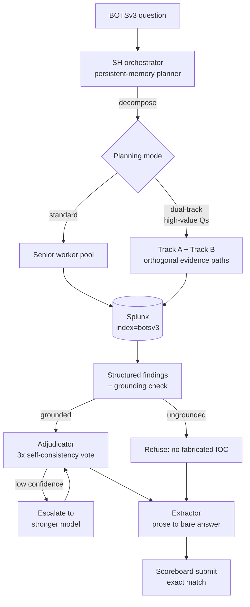

# SIEM Automation

A three-tier LLM agent that investigates realistic SOC incidents in Splunk, benchmarked on Boss of the SOC v3: 26/56 (46.4%), with every trajectory logged.

[](https://github.com/lee1613/SIEM-Automation/actions/workflows/ci.yml)
-blue)


## What this is

This repository is an agent-engineering benchmark built around 56 real forensic questions over a multi-sourcetype Splunk index. The agent plans investigations, delegates independent searches, executes SPL, joins evidence, and self-checks before submitting an exact-match answer. A single agent scored 20/56; the multi-agent pipeline scores 26/56, and the 1000-point tier is still the frontier at 2/9. SIEM is the proving ground here; the project is about observable, grounded agent control under tool and cost constraints.

## Leaderboard

<!-- LEADERBOARD:START -->
| Tier | Solved / Total | Rate |
|------|:---:|:---:|
| 100 pt | 15 / 24 | 62.5% |
| 500 pt | 9 / 23 | 39.1% |
| 1000 pt | 2 / 9 | 22.2% |
| **Overall** | **26 / 56** | **46.4%** — 8000 / 22900 pts |

| Version | Correct | Points | Cost | Notes |
|---|:---:|:---:|:---:|---|
| v0 | 20 / 56 | 5700 | $7.73 | single agent |
| v1.0 | 20 / 58 | 5650 | $7.36 | SH + Senior pool |
| v1.1 | 26 / 56 | 8000 | $0.63 | + Junior tier, cheaper Senior model |
| v1.2 | 26 / 56 | 8000 | $31.36 | + grounding guard, structured findings |
<!-- LEADERBOARD:END -->

Regenerate with `python3 scripts/run_eval.py --write`; CI fails if this table drifts from `log/v1/`.

## Architecture

v1.3/Plan C is the current architecture; all published metrics below come from the v1.2 full run. The v1.3 controls are shipped and unit-tested but have not been benchmarked end to end.



- **Grounding guard:** accepts only answer values present in the question or worker evidence; v1.2 stopped all four previously observed fabrications, although three still scored wrong.
- **Adjudication + 3× sampling:** Plan C ranks competing candidates and uses a strict-majority vote for eligible high-value metrics tasks; its cost and score impact are not yet measured.
- **Escalation:** one bounded follow-up can route low-confidence 1000-point work to a stronger model, then re-adjudicate; this path is unbenchmarked.
- **Dual-track planning:** 1000-point questions require two orthogonal evidence paths, including one unfiltered population enumeration, targeting the measured 2/9 hard-tier result.

See [the architecture document](docs/ARCHITECTURE.md) for responsibilities, implementation paths, and measured-versus-unmeasured tradeoffs.

## Agent trajectory logs

### A 1000-point hit

- Q332 began: “I need to see all available sourcetypes” → `get_source_types()` → `index=botsv3 host=hoth | stats count by sourcetype | sort -count`.
- The pivot tied `/tmp/colonel.c` to `hoth` in `osquery:results`; the extractor submitted `cve-2017-16995` — **correct**.
- Q333 found POST requests in `stream:http` to `/frothlyinventory/integration/saveGangster.action`; “The web lookup confirms that CVE-2017-9791 (S2-048) is the vulnerability” → `cve-2017-9791` — **correct**.
- Evidence: [full Q332/Q333 trajectory](log/v1/run_1.2/timeline.md) and [scored results](docs/scoreboard_result/v1/v1.2.md).

### An honest refusal

- Q303 searched `linux_audit`, `linux_secure`, shell, process, and cloud-init evidence, but found no plaintext password-setting event.
- The agent returned *"The password is not provided in the context"* and was scored **wrong**.
- In a SOC, a confident wrong IOC costs an analyst hours of chasing; the grounding guard makes the agent decline instead of guessing.
- **11 of 56 outputs failed grounding; two were explicit refusals (Q303 and Q328).** (`grounded: false` in the [run summary](log/v1/run_1.2/run_summary.json)). Those refusals cost benchmark points and reflect a deliberate safety trade.
- Evidence: [full Q303 trajectory](log/v1/run_1.2/timeline.md) and [scored results](docs/scoreboard_result/v1/v1.2.md).

## Quick start

Replay the checked-in hard tier offline with Python 3.10+. This needs no API key and no Splunk:

```bash
python3 scripts/run_eval.py --tier 1000
```

Verified output:

```text
Run:      run_1.2
Accuracy: 2/9 = 22.2%
Points:   2000 / 9000

By tier:
  1000 pt    2/9    22.2%

Cost:     $31.36 (whole run)
  zai-org/GLM-5.2-FP8          $26.5326
  gpt-5.4-2026-03-05           $4.8297
  Qwen/Qwen3.6-27B             $0.0000
```

See the [runbook](docs/RUNBOOK.md) for full-run, per-question, test, and live-Splunk commands.

## Lessons learned

1. **Cost is an architecture bug, not a billing line.** v1.1 and v1.2 both scored 26/56, but cost $0.63 and $31.36 respectively as failed delegations rose from 1 to 62. A permissive retry path restarted fresh workers without carrying context, turning a held score into a 50× bill. [Evidence](docs/scoreboard_result/v1/v1.2.md)

2. **Refusal is a feature.** Eleven of 56 outputs failed grounding; two—Q303 and Q328—explicitly refused rather than fabricate. That safer behavior still lost benchmark points. [Evidence](log/v1/run_1.2/run_summary.json)

3. **The frontier is multi-hop.** The 100-point tier reached 62.5%; the 1000-point tier reached 22.2%. The remaining hard-tier work is chained inference, not lookup. [Evidence](datasets/evaluation/leaderboard.json)

4. **The scoring path needs the same rigor as the agent.** `run_summary.json` score keys were silently overwritten by a partial re-run, so the scorer now derives verdicts from submission records instead. [Evidence](docs/ARCHITECTURE.md)

5. **Extractor over-trimming loses correct investigations.** In Q210, evidence supported `fyodor-L`, but extraction dropped the required `-L` and submitted `fyodor`. [Evidence](docs/scoreboard_result/v1/v1.2.md)

## Repo layout

| Path | Purpose |
|---|---|
| [`agent/`](agent/) | Three-tier investigation pipeline and Splunk tools |
| [`datasets/`](datasets/) | BOTSv3 inputs and generated evaluation artifacts |
| [`docs/`](docs/) | Architecture, runbook, and per-version benchmark results |
| [`log/`](log/) | Full trajectory evidence for every scored run |
| [`scripts/`](scripts/) | Standard-library offline scorer and leaderboard generator |
| [`CLAUDE.md`](CLAUDE.md) / [`AGENTS.md`](AGENTS.md) | Agent-assisted development workflow used to build the project |

## Next

The open engineering problems are to cap replan rounds for high-value questions, build a portable replay view of a run's trajectory, and close the 1000-point gap without trading away grounding.

## License and attribution

The code is [MIT licensed](LICENSE). BOTSv3 belongs to Splunk and is redistributed under its original terms; see [dataset provenance and attribution](datasets/README.md).
