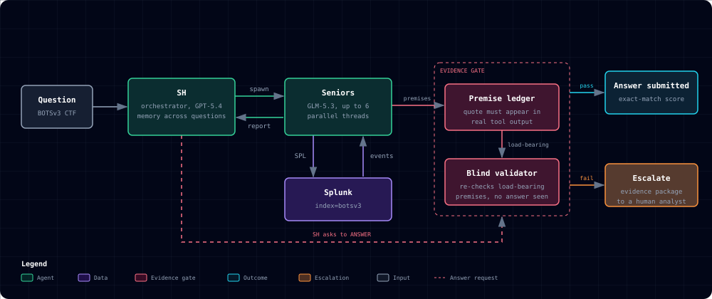

<!-- Improved compatibility of back to top link: See: https://github.com/othneildrew/Best-README-Template/pull/73 -->
<a id="readme-top"></a>

<!-- PROJECT SHIELDS -->
[![CI][ci-shield]][ci-url]
[![MIT License][license-shield]][license-url]

<!-- PROJECT HEADER -->
<br />
<div align="center">
  <h3 align="center">SIEM Automation</h3>

  <p align="center">
    A reference design for production-grade agentic systems: an orchestrator and specialist workers that produce reliable, consistent and interpretable decisions, with evidence-gated answers and a human-in-the-loop escalation path when the evidence is not there. Demonstrated on SIEM investigation (Splunk BOTSv3).
    <br />
    <a href="docs/overview.md"><strong>Explore the docs »</strong></a>
    <br />
    <br />
    <a href="https://siem-automation.streamlit.app/">View Demo</a>
    &middot;
    <a href="https://github.com/lee1613/SIEM-Automation/issues/new?labels=bug">Report Bug</a>
    &middot;
    <a href="https://github.com/lee1613/SIEM-Automation/issues/new?labels=enhancement">Request Feature</a>
  </p>

  [![Released][released-shield]][released-url]
  [![In progress][progress-shield]][progress-url]
  [![Next][next-shield]][next-url]
</div>

<!-- TABLE OF CONTENTS -->
<details>
  <summary>Table of Contents</summary>
  <ol>
    <li>
      <a href="#about-the-project">About The Project</a>
      <ul>
        <li><a href="#latest-result">Latest Result</a></li>
        <li><a href="#built-with">Built With</a></li>
      </ul>
    </li>
    <li>
      <a href="#getting-started">Getting Started</a>
      <ul>
        <li><a href="#prerequisites">Prerequisites</a></li>
        <li><a href="#installation">Installation</a></li>
      </ul>
    </li>
    <li><a href="#usage">Usage</a></li>
    <li><a href="#roadmap">Roadmap</a></li>
    <li><a href="#license">License</a></li>
    <li><a href="#acknowledgments">Acknowledgments</a></li>
  </ol>
</details>

<!-- ABOUT THE PROJECT -->
## About The Project

<p align="center">
  
</p>

An answer is submitted only when it passes the evidence gate. Anything else goes to a person with its evidence trail. [Open the full diagram](https://lee1613.github.io/SIEM-Automation/architecture-diagram.html), which exports to PNG or PDF.

Agent demos fail in production in a predictable way: they answer confidently when they should not. This project is a worked example of the opposite design. An orchestrator (**SH**) plans each investigation and holds memory across questions. Specialist workers (**Seniors**) run the Splunk searches. Nothing is answered until the evidence passes a gate, and when it cannot, the case goes to a person instead of becoming a guess.

The proving ground is [Boss of the SOC v3](https://github.com/splunk/botsv3): 56 exact-match forensic questions over a multi-sourcetype Splunk index. Each answer is graded by exact match and every trajectory is logged, so every claim here traces to a file.

What you can reuse, whatever your domain:

* **Orchestrator and workers.** One agent decides, many search, and only the orchestrator may answer. [`agent/v0/sh_loop.py`](agent/v0/sh_loop.py), [`agent/v0/senior_session.py`](agent/v0/senior_session.py)
* **Evidence-gated answers.** Every premise carries a quote that must appear in real tool output, and the runner refuses an answer that rests on an unchecked premise. [`agent/v0/premise.py`](agent/v0/premise.py)
* **Independent validation.** A blind validator re-checks load-bearing premises without seeing the question or the candidate answer. [`agent/v0/validator.py`](agent/v0/validator.py)
* **Human-in-the-loop escalation.** When the gates are not satisfied the agent refuses and hands over its conversation, the SPL it ran and its premise ledger, so an analyst starts from the lead and never from a confident wrong answer. Packaging that hand-off into one file per question is the [v0.5.1 spec](docs/version_architecture/v0/v0.5.1.md).
* **Run-level observability.** Per-run logs, a timeline, token and cost tracking by role, and resume from the last turn after a crash. [`docs/overview.md`](docs/overview.md)

<p align="right">(<a href="#readme-top">back to top</a>)</p>

### Latest Result

Latest full run: **v0.4.5** (2026-09-24 to 2026-09-25), stopped by the operator after 50 of 56 questions. Full tables for every version are in the [leaderboard](docs/leaderboard.md).

| Metric | Value |
|---|---|
| Correct | **24 / 50** (48%), 6,900 points of the 16,900 recorded |
| Wrong answers submitted | **4**; the other 22 unanswered questions were refusals |
| Precision when it answers | **86%** (the v0.2 baseline on the same 50 questions: 49%) |
| Cost / latency | **$44.95** / 11.3 h summed question time |

Why the 26 wrong answers failed is in the [root cause analysis](log/root_cause_analysis/v0.4.md). The forecast for v0.5.1 (a forecast, not a measurement) and its basis are in the [overview](docs/overview.md#forecast-for-v051-resolving-the-latest-root-causes).

<p align="right">(<a href="#readme-top">back to top</a>)</p>

### Built With

* [![Python][Python.org]][Python-url]
* [![LangGraph][LangGraph.dev]][LangGraph-url]
* [![OpenAI][OpenAI.com]][OpenAI-url]
* [![Splunk][Splunk.com]][Splunk-url]
* [![LangSmith][LangSmith.com]][LangSmith-url]
* [![Streamlit][Streamlit.io]][Streamlit-url]

SH runs on GPT-5.4 and the Senior workers on GLM-5.3.

<p align="right">(<a href="#readme-top">back to top</a>)</p>

<!-- GETTING STARTED -->
## Getting Started

Replaying the checked-in results needs only Python. Running the agent live needs Splunk and API keys.

### Prerequisites

* Python 3.10 or newer
* For live runs: Splunk Enterprise with the BOTSv3 dataset loaded as `index=botsv3` ([setup guide](docs/BOTS_V3_SETUP.md)), and API keys for OpenAI and the Senior model provider

### Installation

1. Clone the repo
   ```sh
   git clone https://github.com/lee1613/SIEM-Automation.git
   cd SIEM-Automation
   ```
2. Install the dependencies
   ```sh
   pip install -r agent/requirements.txt
   ```
3. Copy `agent/.env.example` to `agent/.env` and fill in your keys and your Splunk connection (live runs only)

<p align="right">(<a href="#readme-top">back to top</a>)</p>

<!-- USAGE -->
## Usage

Replay the hard tier of a checked-in run, with no API key and no Splunk:

```sh
python3 scripts/run_eval.py --run run_0.2 --tier 1000
```

```text
Run:      run_0.2
Accuracy: 2/9 = 22.2%
Points:   2000 / 9000
```

Run a smoke test of the agent on chosen questions (output goes to `log/temp/` and is filed under `log/v0/` afterwards):

```sh
python agent/v0/run_all_v0.py --ids Q216,Q217
```

A full run costs about $45 and takes about 11 hours, so it is started deliberately with `--version`. See the [runbook](docs/RUNBOOK.md) for full runs, resuming, tests and live-Splunk commands, and the [trajectory logs](docs/overview.md#agent-trajectory-logs) for a worked 1000-point hit and an honest refusal.

| Path | Purpose |
|---|---|
| [`agent/`](agent/) | SH orchestrator, senior pool, premise ledger, memory and Splunk tools (`agent/v0/`) |
| [`datasets/`](datasets/) | BOTSv3 questions, answers and evaluation artifacts |
| [`docs/`](docs/) | Per-version architecture docs, results and the [overview](docs/overview.md) |
| [`log/`](log/) | Full trajectory evidence for every scored run |
| [`scripts/`](scripts/) | Standard-library offline scorer and leaderboard generator |

<p align="right">(<a href="#readme-top">back to top</a>)</p>

<!-- ROADMAP -->
## Roadmap

- [x] v0.1 Parallel hypotheses: up to six Seniors in parallel (+6 correct)
- [x] v0.4.x Conversational loop, premise ledger and blind validator, SH memory across questions
- [ ] v0.5.0 Reliability: background summaries, an incident timeline, per-call context checks, retries ([design](docs/version_architecture/v0/v0.5.0.md))
    - [ ] Branch `feat/v0.5.0-memory`, red tests committed, implementation in progress
- [ ] v0.5.1 Escalation package for every refusal, cheaper verification once an answer is held, a working web search ([spec](docs/version_architecture/v0/v0.5.1.md))
- [ ] Per-question work on search misses and wrong values (host and attack-phase disambiguation, answer-format checks)

See the [open issues](https://github.com/lee1613/SIEM-Automation/issues) for the full list of proposed features and known issues.

<p align="right">(<a href="#readme-top">back to top</a>)</p>

<!-- LICENSE -->
## License

The code is distributed under the MIT License. See [`LICENSE`](LICENSE) for more information. BOTSv3 belongs to Splunk and is redistributed under its original terms; see [dataset provenance and attribution](datasets/README.md).

<p align="right">(<a href="#readme-top">back to top</a>)</p>

<!-- ACKNOWLEDGMENTS -->
## Acknowledgments

* [Splunk Boss of the SOC v3](https://github.com/splunk/botsv3)
* [Best-README-Template](https://github.com/othneildrew/Best-README-Template)
* [Shields.io](https://shields.io)

<p align="right">(<a href="#readme-top">back to top</a>)</p>

<!-- MARKDOWN LINKS & IMAGES -->
[ci-shield]: https://img.shields.io/github/actions/workflow/status/lee1613/SIEM-Automation/ci.yml?style=for-the-badge&label=CI
[ci-url]: https://github.com/lee1613/SIEM-Automation/actions/workflows/ci.yml
[license-shield]: https://img.shields.io/github/license/lee1613/SIEM-Automation.svg?style=for-the-badge
[license-url]: https://github.com/lee1613/SIEM-Automation/blob/main/LICENSE
[released-shield]: https://img.shields.io/badge/released-v0.4.5%20%C2%B7%2024%2F50-2ea44f?style=for-the-badge
[released-url]: docs/scoreboard_result/v0/v0.4.5.md
[progress-shield]: https://img.shields.io/badge/in%20progress-v0.5.0-d29922?style=for-the-badge
[progress-url]: docs/version_architecture/v0/v0.5.0.md
[next-shield]: https://img.shields.io/badge/next-v0.5.1-6e7781?style=for-the-badge
[next-url]: docs/version_architecture/v0/v0.5.1.md
[Python.org]: https://img.shields.io/badge/python-3776AB?style=for-the-badge&logo=python&logoColor=white
[Python-url]: https://www.python.org/
[LangGraph.dev]: https://img.shields.io/badge/LangGraph-1C3C3C?style=for-the-badge&logo=langchain&logoColor=white
[LangGraph-url]: https://www.langchain.com/langgraph
[OpenAI.com]: https://img.shields.io/badge/OpenAI-412991?style=for-the-badge&logo=openai&logoColor=white
[OpenAI-url]: https://openai.com/
[Splunk.com]: https://img.shields.io/badge/Splunk-000000?style=for-the-badge&logo=splunk&logoColor=white
[Splunk-url]: https://www.splunk.com/
[LangSmith.com]: https://img.shields.io/badge/LangSmith-1C3C3C?style=for-the-badge&logo=langchain&logoColor=white
[LangSmith-url]: https://smith.langchain.com/
[Streamlit.io]: https://img.shields.io/badge/Streamlit-FF4B4B?style=for-the-badge&logo=streamlit&logoColor=white
[Streamlit-url]: https://streamlit.io/
