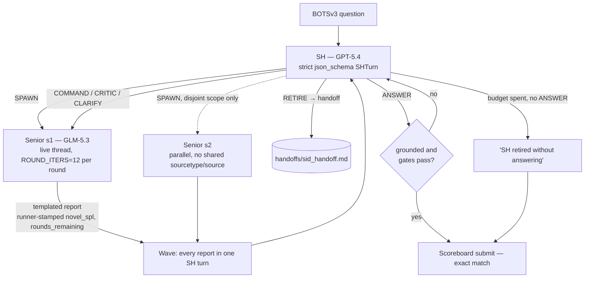
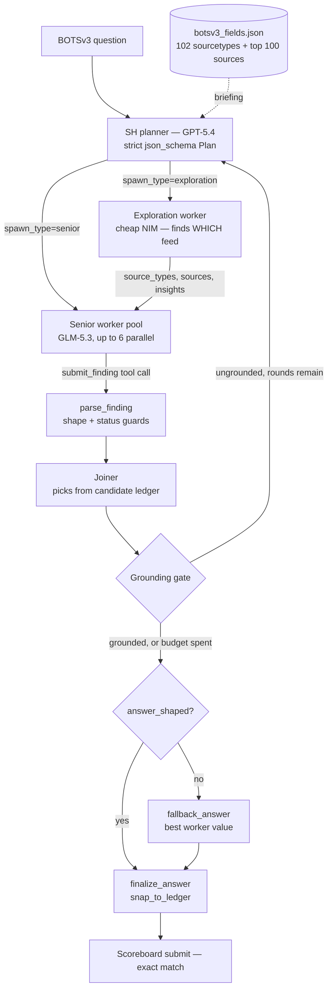

# Architecture

> **Current code is v1.4.1**, the conversational SH ↔ Senior loop and the default
> `--loop conversational` (`docs/version_architecture/v1/v1.4.0.md`, `v1.4.1.md`). v1.4.0 is
> the architecture as smoke-tested on five hard questions. v1.4.1 adds the hardening made after
> that test and has not yet been run. **No v1.4 version has had a full run.** The only full-run
> numbers that exist are **v1.2's**: 26/56, 8000 points, $31.36
> (`docs/scoreboard_result/v1/v1.2.md`). Nothing here extrapolates a measurement from one
> version to another; where a claim has no measurement, it says so.
>
> The v1.3.0 plan-and-execute loop is still in the code as `--loop compiler`, the A/B control.
> It is described below from [Two tiers](#two-tiers) on, and every deterministic guard it
> introduced is shared by both loops.

## The conversational loop (v1.4) — `agent/v1/sh_loop.py`

v1.3.0 planned a DAG of one-shot workers. A joiner read their results, and a `REPLAN:` threw
them away and briefed fresh ones from zero. v1.4 replaces that with a **bounded
conversation**. A few question-scoped seniors keep their LangGraph thread across rounds. Each
one files a templated report at the end of every round, and SH reads all the reports of a wave
in **one** turn, grades them, and routes each senior.

**Six routes** in one strict `json_schema` (`agent/v1/conversation.py`):

| Route | What it does |
|---|---|
| `SPAWN` | open a senior, either plain or `metrics` (the only technique tag left after v1.4.1's prune) |
| `COMMAND` | continue, or change scope, with a directive for the next round |
| `CRITIC` | name a flaw from a closed five-value `basis` enum and say how to fix it |
| `CLARIFY` | ask the senior a question without spending a round |
| `RETIRE` | stop a senior; it writes a handoff |
| `ANSWER` | submit a value, citing the senior report it came from |

**The report** (`agent/v1/senior_report.py`) has a fixed template: Prior rounds (rewritten each
round, at most 6 lines), This round, **Assumptions**, Ruled out, **Open questions for SH**. The
runner stamps `rounds_remaining` and `novel_spl_count` itself, because a self-reported progress
number is one the senior can report favourably.

**The rubric.** SH grades every report it reads:

| Grade | Question | Teeth |
|---|---|---|
| **R1** scope | is this the question that was asked? | FAIL blocks ANSWER |
| **R2** progress | did the round learn something new? | code overrides: `novel_spl == 0` is FAIL; two FAILs in a row force a change |
| **R3** readiness | is a value ready to submit? | advisory |
| **R4** premise verification | are the premises the conclusion rests on verified? | **warning only** (v1.4.1): UNVERIFIED premises are flagged in the wave, and the senior's next directive opens with "verify these first" |

**Gates**, all deterministic, all in `conversation.py`, and a rejected turn goes back to SH
with the reason:
- **Anti-thrash:** no plain `continue` after two R2 FAILs in a row.
- **Wrong question:** R1 = FAIL blocks ANSWER.
- **Cut-off:** a report that hit the iteration cap cannot back an ANSWER.
- **Open questions:** SH must answer every one of the senior's open questions. The answers
  travel with its next directive.
- **Parallel scope (v1.4.1):** a second concurrent senior must share no sourcetype/source with
  any running one.

**Budgets** (`agent/v1/question_state.py`), keyed off the question's points:

| Tier | Seniors | Rounds **per senior** | SH turns | Iterations per round | Ceiling |
|---|---|---|---|---|---|
| 1000 pt | 3 | 8 | 12 | 12 | 288 |
| 500 pt | 2 | 5 | 8 | 12 | 120 |
| 100 pt | 1 | 3 | 5 | 12 | 36 |

SH normally runs one senior. It opens a second in parallel only when it has a competing
suspicion that can be checked on different data. A question ends when one of these happens:
- a grounded ANSWER passes every gate;
- SH turns run out;
- every spawn slot is used and no active senior has rounds left;
- a second ANSWER fails grounding.

**Only SH answers.** If the budget runs out without an accepted ANSWER, the submission is the
literal `SH retired without answering`. It is scored wrong, and no senior value is ever
submitted behind SH's back.

**Artifacts** (`agent/v1/conversation_log.py`), per question: `conversation.md` (every turn,
grade, directive and rejection), each senior's round reports, and `handoffs/`.
`agent/v1/grade_report.py` builds the grade distribution (R1–R4, and R2 as SH graded it vs
as it took effect).

## Measured: v1.4.0 five-question smoke test (2026-09-18)

The five hard questions are Q216, Q217, Q224, Q328 and Q329. Every one survived two full runs,
and v1.2 got all five wrong. Cost is priced by the tracker (`PRICES_PER_1M`), not
provider-billed, and is broken out by role.

| | v1.3.0, mini senior | v1.4.0, GLM-5.3 senior | v1.4.0, mini senior |
|---|---|---|---|
| Score | 0/5 | **2/5** (Q224, Q328) | 0/5 |
| Cost | $1.36 (SH $0.29 / senior $1.07) | $6.45 (SH $0.39 / senior $6.06) | $1.26 (SH $0.57 / senior $0.69) |
| Per question | $0.27 | $1.29 | $0.25 |
| Latency, 5 questions | 18 min | 98 min | 37 min |

What the table shows:
- **The new design costs less.** On the same `gpt-5.4-mini` senior, the conversational loop
  cost about 7% less than the plan-and-execute loop ($1.26 vs $1.36). The senior's share fell
  from $1.07 to $0.69, because live seniors stop re-briefing replacements from zero. SH's share
  rose, because it now reads and grades every round.
- **GLM-5.3 is the reliable senior.** It solved two questions that v1.2 and v1.3.0 never had,
  Q224 and Q328. The same loop with a mini senior solved none, so the score came from the
  senior model. GLM-5.3 has not been run on the v1.3.0 loop, so how much of the 2/5 is due to
  the loop itself is unmeasured.
- **Latency roughly doubled** (18 → 37 min on the same senior), because the conversation is
  sequential: SH waits for each wave and each senior waits for SH. Questions are independent,
  so solving them in parallel should recover most of this (`future_work.md` #6).

Details, transcripts and the per-question breakdown are in
`docs/version_architecture/v1/v1.4.0.md`.

## Two tiers

*(The compiler loop, `--loop compiler`: v1.3.0's plan-and-execute architecture, kept as the
A/B control. The worker pool, grounding gate, submit guard, manifest and connection pool
below are shared with v1.4.)*

### SH orchestrator — `agent/v1/orchestrator.py`

GPT-5.4. A three-node LangGraph — `planner → executor → joiner` — with the joiner able to
route back to either. It holds planning strategy, cross-question memory, round budget, and
answer selection; it never touches Splunk itself.

The planner emits a **strict `json_schema` structured `Plan`** (`agent/v1/plan_schema.py`),
not prose. Each `Spawn` in it declares `{spawn_type, subquestion, sourcetypes, sources,
prior_info, confidence, deps}`. `deps` carries `$N` substitution, so tasks depending on an
earlier result wait for it while independent ones run concurrently.

`MAX_PLAN_ROUNDS = 3` planner→executor→joiner cycles per question; `MAX_WORKERS = 6`
workers per wave, matching `SplunkConnectionPool`'s six connections.

### Worker pool — `agent/v1/splunk_subagent.py`

Two kinds of worker, both fresh-session (new `thread_id`, no cross-task memory) so one
task's assumptions cannot contaminate another.

**Senior** (`zai-org/GLM-5.3` on Featherless) runs the actual investigation. Six pre-built graphs: three
specialist prompts (`hunter` / `content` / `metrics`, in `agent/v1/specialists.py`) × two
iteration budgets (`iter_budget` gives 25 iterations at ≥500 points, `MAX_ITER` otherwise).
Tools are the seven Splunk ones in `agent/splunk_agent.py` — `run_splunk_search`,
`get_sources`, `get_sourcetype_fields`, `get_field_values`, `sample_events`,
`search_keyword`, `get_raw_events` — plus `web_lookup` and `submit_finding`.

**Exploration** (`agent/v1/exploration.py`, a cheap NIM model) answers *where does this data
live*, not *what is the answer*. SH spawns it when it cannot name a search space at all. Its
pivots are ordered by measured cost, and the ordering is the point:

| pivot | time | found |
|---|---|---|
| `\| metadata type=sources … search source=*cisco*` | 1.1s | all 3 feeds |
| `index=botsv3 source=*cisco* \| stats count by source` | 3.2s | all 3 feeds |
| `index=botsv3 *cisco* \| stats count by source` | 28.4s | **1 of 3** |

The obvious query is the worst: it scans raw event *text*, so it misses `cisconvmflowdata`
— 78,459 events, rank 13 of 1003 sources — whose Cisco-ness is in its name, not its
payloads, while costing 26× the cheapest pivot. Content scans are capped at 2 per run. The
risk is not timeout (`splunk_client` allows 600s) but **pool starvation**: six connections,
six workers, so a 40s scan holds a slot for its whole duration.

> In the v1.3.0 smoke test SH chose exploration **zero times** out of 25 spawns. This tier
> is currently unexercised code.

## Data and control flow

## Control mechanisms

Every guard below is **deterministic**. That is deliberate. v1.3.0 deleted the verifier, the
adjudicator, and 3× self-consistency sampling (−897 lines) because none of them could be
shown to work: sampling reached a majority **0 times in 14** attempts, the verifier scored
43% against 48% for no verifier, and the adjudicator never produced a measurable number.
The deterministic guards survived because they *can* be measured — the grounding gate was a
perfect failure predictor on run_1.2 (`grounded=False → 0/11 correct`).

### Structured worker returns — `agent/v1/finding.py`

A worker finishes with a `submit_finding` **tool call** whose arguments are the schema,
rather than prose that downstream code scrapes. Scraping is what cost run_1.2 5,100 points:
not wrong investigation, but wrong transcription (`BSTOLL-L.froth.ly`→`BSTOLL-L`,
`nullweb_admin`→`web_admin`, `1367.875`→`1499.25`). Prose parsing remains as a fallback and
`structured` records which path was taken — 72% structured in the smoke test.

Two guards run on the parsed finding:

- **`answer_shaped`** — `value` must be submittable or empty: single line, ≤200 chars,
  ≤12 words, alphanumeric, no `?`. Calibrated on all 58 real answers (max 110 chars, max 11
  words, no newlines, no question marks). An unshaped value moves to `notes` rather than
  being dropped. A hedge is **rejected, not repaired** — `"buser?"` does not become
  `"buser"`, because stripping a hedge manufactures confidence out of doubt.
- **`SOLVED_MIN_CONFIDENCE = 50`** — `solved` below it reads as `partial`. A worker cannot
  be both confident and unsure, and `status` is the field the joiner ranks on.

Both were added after the smoke test showed 8 of 18 non-empty values were unsubmittable
prose, and that Q216's wrong answer came from a `solved` finding at confidence 38.

### Grounding gate — `agent/v1/grounding.py`

Accepts an answer only when the whole value — or every component of a genuine
comma-separated list — appears in the question or in worker evidence. Ungrounded with rounds
remaining: targeted replan. Ungrounded with budget spent: fall back to the best available
result. The guard never manufactures a refusal, though one can survive as that result.

Measured on run_1.2: `grounded=True → 26/45`, `grounded=False → **0/11**`. It did not
recover points — three of four previously-fabricated cases stayed wrong — but it converted
confident fabrication into visible failure.

### Candidate ledger — `agent/v1/case_file.py`

Every delegation's committed value is captured **verbatim** at delegation time with its
evidence and SPL. The joiner chooses *from* the ledger and copies rather than retyping;
`finalize_answer` runs `snap_to_ledger` at the true submit choke point, so every path —
normal, post-hint, and post-fallback — is covered. `extract_candidate` applies
`answer_shaped` to its prose fallback too: the ledger instructs the joiner to copy
character-for-character, so an unsubmittable entry is worse than no entry.

### Submit guard — `answer_shaped`

The last thing between SH and the scoreboard. An answer must be a single non-empty line,
≤200 chars, ≤12 words, containing alphanumerics and no `?`. Anything else routes to
`fallback_answer`, which takes the highest-status worker's schema-B `value`.

This guard used to sit on the extractor's output. **There is no extractor any more**: over
84 recorded extractions the tier changed nothing 57 times, saved one wrong answer, and
destroyed one correct one (`'1368'` → `'2085'`). Net zero — and it produced both
catastrophic submissions on record, Q329's 4,487-char chain-of-thought dump and the Q331
corruption above. It was a no-op so often because SH already emits a bare value:
`orchestrator.py` strips the `FINAL ANSWER:` tag and keeps line one, so real `sh_answer`
values are `'7071'`, `'bar chart'`, `'6.80'`.

The one case the extractor genuinely rescued — SH emitting an Option B `REPLAN:` block as
its final answer — is now caught here deterministically, with no model.

### Dual-track planning

For 1000-point questions, `run_all_v1.py` instructs SH to produce two orthogonal task
tracks, at least one of which enumerates the candidate population **unfiltered** before
narrowing. This targets premature narrowing — v1.2 solved only 2 of 9 in that tier.

> **Known hazard, unresolved.** Track 2 is meant as corroboration, but nothing marks it as
> such, so its output competes as a peer candidate. In Q216 the corroboration track's answer
> won over both workers on the feed the question named. `Spawn` has no `role` field yet.

### Hint economy

Opt-in (`--hints`). A ≥500-point question whose answer fails the grounding gate buys
official hint 1, re-runs SH with it, and subtracts the hint cost from points earned.

## Two-axis addressing

Splunk data has two independent axes and the manifest carries both:

- **`sourcetype`** — the parser label. 102 of them in `botsv3`.
- **`source`** — the feed. 1003 of them, and a single sourcetype can hide many unrelated
  feeds.

`agent/botsv3_fields.json` holds both, generated by `agent/build_manifest.py`. SH's opening
briefing lists **all 102 sourcetypes plus the top 100 sources by volume** (~2,054 tokens).
The tail is 903 sources holding **0.435%** of events; the top 100 covers **99.565%** at
~1.4K tokens against ~31K for all of them.

Volume ranking comes from `stats count`, never from `| metadata`'s `totalCount`, which is
bucket-derived and unreliable — it reports `source=lsof` at 103 events where `stats` reports
322,336. `metadata` is trusted only for names and `firstTime`/`lastTime`.

> **The manifest lists field names with no types and no example values.** This is an active
> hazard. In Q216 a worker picked `fst`/`fet` (display strings, `"Mon Aug 20 10:47:05 2018"`)
> over `fss`/`fes` (epochs) for a duration calculation. Splunk answers arithmetic on date
> strings with a **silent null** — no error, the column simply vanishes — so the worker
> concluded the data was absent. It was not guessing: `get_sourcetype_fields` had returned
> all four names *with sample values, on adjacent lines*, seven steps earlier.

## Connection pool

`agent/splunk_pool.py` holds six `SplunkClient` connections, matching `MAX_WORKERS`. Workers
hold the **pool**, not the client, and the pool forwards every public client method through
`__getattr__` rather than hand-written mirrors.

That design is a scar. The mirrors existed, the client was widened to the `source` axis, and
the mirrors were not — so every source-scoped call failed on every worker in the first
v1.3.0 run while `test_source_axis.py` stayed green, because its fake borrowed
`SplunkClient`'s methods directly and proved the right thing about a layer no agent holds.
`agent/v1/tests/test_pool_contract.py` now asserts the contract *between* the layers and was
verified against a simulated old pool to confirm it actually fails.

## Run artifacts

A versioned full run writes to a `log/v1/run_1.N/` root; smoke runs (`--ids` / `--limit`) go to
`log/temp/` and are not versioned, compared, or cost-tracked.

`agent/v1/agent_logger.py` creates the run root, `timeline.md`, and `events.jsonl`.
`agent/v1/run_all_v1.py` writes `case_file.json`, `sh_checkpoints.sqlite`,
`scoreboard_submissions.json`, `metrics.json`, `run_summary.json`, and per-question
`questions/<qid>.json`. Per-step LLM and tool traces go to LangSmith; the historical
`SH/` / `Senior Splunk/` / `Junior Splunk/` / `Extractor/` role directories are **not**
emitted, and there is no Junior dispatch path.

`scripts/run_eval.py` reads only `scoreboard_submissions.json` for verdicts and
`run_summary.json`'s `token_usage` for cost. It ignores `run_summary["score"]`, which can be
stale — run_1.1's was overwritten by a later partial re-run.

`agent/v1/spawn_report.py` is a post-hoc reader over `questions/*.json`: spawn counts,
outcome split, structured-vs-prose rate, and solved-rate by SH confidence decile.

## Known limitations

- **The 1000-point tier is mostly unsolved.** v1.2 solved 2 of 9. On five of the survivors,
  v1.3.0 scored 0/5 and v1.4.0 with a GLM-5.3 senior scored 2/5 (Q224, Q328). That is a smoke
  test, not a full run.
- **The conversational loop is sequential.** Latency is about 2× v1.3.0 on the same senior.
  Questions are independent, but the runner solves them one at a time. `future_work.md` #6.
- **The SH turn caps (5 / 8 / 12) can bind before per-senior rounds** when seniors run one
  after another. Watch for `end_reason = turns` on v1.4.1 runs. `future_work.md` #8.
- **Confidence is recorded but uncalibrated, and not even monotonic** — 90–99 → 0/3 while
  30–39 → 1/1 across 25 spawns. Nothing routes on it. `future_work.md` #4.
- **NIM models are priced at zero**, so every reported cost is OpenAI-only. The architecture
  deliberately pushes work toward that untracked tier, so the blind fraction grows as the
  strategy succeeds. `future_work.md` #2.
- **The joiner's LLM synthesis step has never been isolated.** The deterministic guard around
  it has receipts; the call itself does not. `future_work.md` #3.
- **Cross-question findings are partly discarded.** In v1.4 a senior's dead ends survive
  within a question, because its thread is live and its report has "Ruled out". The
  `handoffs/` written at retirement are never read back into the case file, though, so the
  next question starts without them. `future_work.md` #7.
- **Q216 was thought unwinnable here, and it is not.** The Cisco NVM add-on is inert (the
  events are indexed as `syslog`), and the powershell mining flows top out at 1660. The
  2026-09-18 threat-hunter review of the Q216 logs found that the official 1666 is on a
  different endpoint: the Coinhive websocket sessions from `chrome.exe` on BSTOLL-L
  (1534773920 − 1534772254). The agent's miss was a wrong-entity premise it never tested,
  which is what R4 now targets. `future_work.md` #5.
