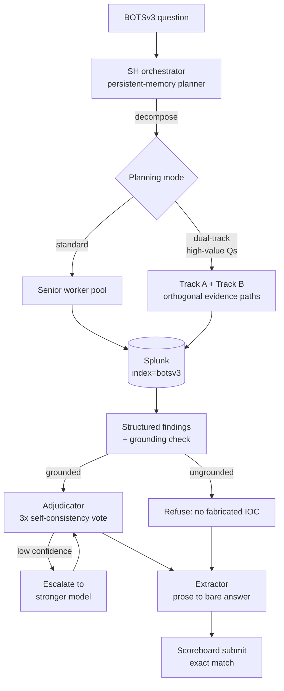

# Architecture

> **v1.3 (Plan C) is the current architecture. The published metrics are from the v1.2 full run** — v1.3's adjudication, escalation, dual-track planning, and self-consistency sampling are shipped and unit-tested but not yet benchmarked end to end. Numbers here are never extrapolated to unrun versions.

## Three-tier layout

### SH orchestrator

The SH orchestrator in `agent/v1/orchestrator.py` is the persistent-memory control plane: GPT-5.4 plans a dependency-aware task graph, dispatches ready tasks in parallel, joins the evidence, adjudicates competing candidates, and verifies high-value answers. This tier exists to keep investigation strategy, cross-question context, retry limits, and answer selection in one place while leaving Splunk execution to fresh workers.

### Senior/Junior worker pool

The worker pool in `agent/v1/splunk_subagent.py` runs isolated Splunk investigations with specialist prompts for hunting, content inspection, and metrics. The current Plan C path dispatches Senior workers on GPT-5.4-mini and can escalate once to GPT-5.4; it does not dispatch a Junior model, although the historical artifact layout still reserves a Junior role. Fresh worker sessions prevent one task's assumptions from contaminating another and let independent evidence paths run concurrently.

### Extractor

The Extractor in `agent/v1/extractor.py` uses `meta/llama-3.3-70b-instruct` at temperature 0 to reduce the SH's prose to the bare, exact-match scoreboard value. This tier exists because investigation and output normalization are different jobs: workers preserve evidence and reasoning, while the Extractor emits one submission-shaped answer.

## Data and control flow

## Control mechanisms

### Grounding guard

`agent/v1/grounding.py`, enforced by `agent/v1/orchestrator.py`, accepts an answer only when the whole value—or every component of a genuine comma-separated list—appears in the question or worker evidence. Plan C also guards thousands-separated numbers and carries evidence across replan rounds. In the v1.2 full run, all four previously fabricated cases stopped fabricating, but three remained wrong, so the measured benefit was safer failure rather than recovered points; repeated failed-worker replans still helped drive failed delegations from 1 to 62. See `docs/scoreboard_result/v1/v1.2.md` and the fixes recorded in `docs/version_architecture/v1/v1.3.md`. Plan C's strengthened guard is unit-tested but has no end-to-end cost or score measurement yet.

### Adjudication and 3× sampling

`agent/v1/adjudicator.py` ranks ledger candidates by question constraints, verbatim field fidelity, answer shape, and evidence strength; `agent/v1/orchestrator.py` invokes it when at least two candidates exist. For metrics tasks worth at least 500 points, the executor runs three temperature-0.3 samples and keeps a strict-majority verbatim candidate when one exists. The v1.2 result shows why selection matters—several misses were grounded but wrong—but v1.2 had neither mechanism. Plan C deliberately pays up to three worker runs for eligible metrics tasks; `docs/version_architecture/v1/v1.3.md` records the cost guard and unit coverage, but no full-run cost or benefit has been measured.

### Escalation

`agent/v1/orchestrator.py` permits one bounded follow-up when adjudication is tied or low-confidence, while `agent/v1/splunk_subagent.py` routes low-confidence 1000-point cases from GPT-5.4-mini to GPT-5.4 and then re-adjudicates. The observed v1.2 opportunity was seven misses among nine 1000-point questions; escalation did not exist in that run. Its extra strong-model worker call is an intentional cost, but Plan C has not yet produced a full-run measurement of either spend or recovered points. See `docs/scoreboard_result/v1/v1.2.md` and `docs/version_architecture/v1/v1.3.md`.

### Dual-track planning

For each 1000-point question, `agent/v1/run_all_v1.py` adds a dual-track instruction and `agent/v1/orchestrator.py` requires two orthogonal evidence paths, including one unfiltered population enumeration. This targets premature narrowing: the v1.2 full run solved only 2 of 9 questions in the 1000-point tier. Two tracks can dispatch more workers than a standard plan, but the v1.3 source records no end-to-end score or cost yet, so the only measured baseline remains `docs/scoreboard_result/v1/v1.2.md`.

## Run artifacts

A versioned full run uses the log/v1/run_1.N/ layout. The artifact contract reserves `SH/` for orchestrator captures, `Senior Splunk/` and `Junior Splunk/` for worker captures, and `Extractor/` for normalization captures; the Junior directory can be empty because current Plan C has no Junior dispatch path. The same run root contains `timeline.md` for the sequential narrative, `run_summary.json` for rollups and token usage, and `scoreboard_submissions.json` for submitted and official answers. The v1.2 example is `log/v1/run_1.2/`.

`scripts/run_eval.py` consumes only `scoreboard_submissions.json` for exact-match verdicts and the `token_usage` object in `run_summary.json` for cost. It intentionally ignores the role logs, `timeline.md`, and the summary's cached score fields. In particular, `run_summary["score"]` can be stale: run_1.1 was overwritten by a later partial re-run, so verdicts come from `scoreboard_submissions.json`, not the summary.

## Known limitations

- **The highest-value tier remains weak.** The measured v1.2 baseline solved 2 of 9 1000-point questions; Plan C's dual-track, adjudication, sampling, and escalation controls have not yet been benchmarked against that tier. See `docs/scoreboard_result/v1/v1.2.md`.
- **Failed delegations can dominate cost.** From v1.1 to v1.2, failed delegations rose from 1 to 62 while estimated cost rose from $0.63 to $31.36. The v1.2 result attributes 85% of spend to Senior workers and identifies blind replan churn as the cause. See `docs/scoreboard_result/v1/v1.2.md`.
- **Extraction can remove meaningful answer text.** In v1.2, Q210's correct `fyodor-L` evidence became `fyodor` after extraction, losing the required `-L` suffix. The current Extractor model and ledger snap are shipped but have not been validated by a full Plan C run. See `docs/scoreboard_result/v1/v1.2.md` and `docs/version_architecture/v1/v1.3.md`.
