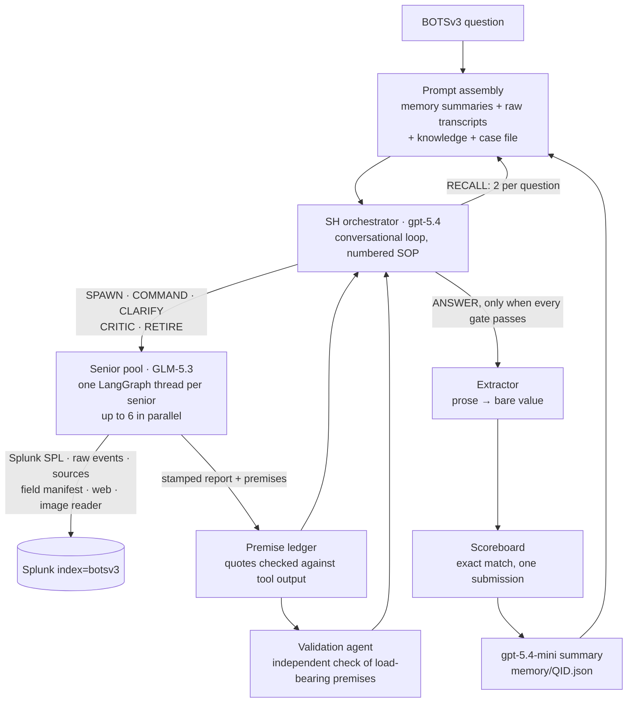

# Project overview

The depth behind the [README](../README.md): why accuracy moved, how the agent refuses, the architecture, the context pipeline, resumability, the roadmap with forecasts, trajectory logs and lessons learned. The generated results table lives in [leaderboard.md](leaderboard.md).

## Contents

- [Why accuracy moved, and what refusal means](#what-moved-accuracy)
- [Current performance](#current-performance-v045-2026-09-24-to-2026-09-25)
- [Architecture](#architecture-v045)
- [Context management pipeline](#context-management-pipeline)
- [Resumable architecture](#resumable-architecture)
- [Roadmap and forecasts](#next-v050-design-approved-tests-written-implementation-in-progress)
- [Agent trajectory logs](#agent-trajectory-logs)
- [Lessons learned](#lessons-learned)

### What moved accuracy

- **Parallel hypotheses (v0.1): +6 correct.** Up to six seniors chase competing explanations at once instead of one after another. This is still the largest single jump, 20 to 26.
- **Structured returns (v0.3.0).** v0.2 lost about 5,100 points to transcription, not investigation: the right evidence was scraped from prose into the wrong value (`BSTOLL-L.froth.ly` became `BSTOLL-L`, `1367.875` became `1499.25`). Seniors now return a `submit_finding` tool call whose fields are the answer.
- **Knowing where the data lives (v0.3.0).** SH is briefed with all 102 sourcetypes and the top 100 sources (99.6% of events), and seniors can search by `source` as well as `sourcetype`. That is how Q216's Cisco NVM feed was found: it is source rank 13, hidden under the generic `syslog` sourcetype.
- **Removing what didn't measure (v0.3.0).** Self-consistency sampling reached a majority 0 times in 14, and the verifier scored within noise of no verifier. Both were deleted (−897 lines). The deterministic grounding check stayed: `grounded=False` was 0/11 correct, a perfect failure predictor.
- **A reasoning senior model (v0.4.0).** In the same conversational loop, gpt-5.4-mini seniors scored 0/5 on the hard set and GLM-5.3 scored 2/5. Q224 and Q328 were solved for the first time in any version.
- **Seniors that keep their thread (v0.4.0).** A senior now survives across rounds, and SH grades every report and steers it with a typed route, instead of throwing workers away and re-briefing new ones from zero.
- **Evidence must be real (v0.4.2 to v0.4.4).** Every premise needs a quote that appears in tool output the senior really received, and a blind validation agent re-checks load-bearing premises without seeing the question or the candidate answer. Q216, run alone 15 times, shows what this bought and what it didn't: answers first scattered (7113, 3564, 1758, 7070), then settled, with 9 of the last 12 runs answering 112. It became consistent but wrong, because the checks confirmed citations, not soundness. v0.4.4's soundness changes moved it to 1667, within one of the answer.

### From false confidence to honest refusal

Accuracy barely moved between v0.2 and v0.4.5. What changed is what the system does when it is unsure:

| Run | Questions | Correct | Wrong answer submitted | Refused | Correct ÷ submitted |
|---|:---:|:---:|:---:|:---:|:---:|
| v0.0.0 | 56 | 20 (36%) | 36 (64%) | 0 | 36% |
| v0.0 | 58 | 20 (34%) | 38 (66%) | 0 | 34% |
| v0.1 | 56 | 26 (46%) | 30 (54%) | 0 | 46% |
| v0.2 | 56 | 26 (46%) | 28 (50%) | 2 (4%) | 48% |
| v0.2, the same 50 questions as v0.4.5 | 50 | 24 (48%) | 25 (50%) | 1 (2%) | 49% |
| **v0.4.5** | 50 | **24 (48%)** | **4 (8%)** | **22 (44%)** | **86%** |

- **Same questions, same number correct.** On the 50 questions v0.4.5 reached, v0.2 also got 24 right (6,000 points against v0.4.5's 6,900).
- **v0.2 was confidently wrong half the time.** It submitted 25 wrong values on those 50 questions, each stated as fact, and refused once (Q303).
- **v0.4.5 submitted 4 wrong answers** (Q216, Q217, Q310, Q320). When it answers, it is right 86% of the time, against 49% for v0.2.
- **Three design choices produced this.**
  - Only SH may answer, so a senior's unchecked value can't slip through when the budget runs out (v0.4.1).
  - The F2 gate blocks ANSWER while any load-bearing premise is unverified.
  - The validator is an independent reader, so a senior can't certify its own claim.
- **A refusal routes the case to a human.** When the checks aren't satisfied, SH refuses with `SH retired without answering` instead of guessing. It hands over its reasoning and investigation path so an analyst can pick up the case:
  - SH's full conversation and every senior report (`questions/<QID>.json`, `timeline.md`);
  - the SPL that ran;
  - the premise ledger, showing which claims are verified and which are still open (`premise_ledgers/<QID>.json`).

  The analyst starts from the lead, not from zero, and is never handed a confident wrong IOC to chase.

### Most refusals had already found the answer

The refusals are not a sign that the investigation failed. Of the 22 v0.4.5 refusals, 20 ended because the turn or round budget ran out, not because SH judged the answer absent from the data. Only Q213 and Q301 ended with an explicit `NOT_FOUND`. Sorted by how far each got:

| Where the refused investigation stood | Questions | Points |
|---|:---:|--:|
| Held the exact official answer as a candidate, but ran out of turns while verifying premises | 8: Q221, Q300, Q309, Q312, Q315, Q316, Q317, Q326 | 2,800 |
| Had the right lead with a slightly wrong value (an extra suffix, a first-seen ordering, a miscount of the right email) | 3: Q202, Q212, Q321 | 1,100 |
| Built on another question's wrong conclusion | 3: Q308, Q311, Q322 | 1,100 |
| Never found the right evidence, or the answer is only on the web | 8 | 2,000 |

Half of the refusals (11 of 22) had reached the right evidence. The 8 that held the exact answer alone would have taken v0.4.5 from 24 to **32 of 50**, well past every earlier version on the same questions. The investigation is working; what loses points now is the budget spent proving premises after the answer is in hand. That is a problem in the gates, not the reasoning, and it is the target after v0.5.0: make verification cheaper without loosening it.

## Current performance: v0.4.5 (2026-09-24 to 2026-09-25)

| Metric | Value |
|---|---|
| Questions recorded | 50 / 56 (stopped by the operator; Q328–Q333 not recorded) |
| Correct | **24 / 50** (48%): 100 pt 14/24, 500 pt 9/23, 1000 pt 1/3 |
| Points | **6,900** of the 16,900 recorded (22,900 in the dataset) |
| Cost (recorded) | **$44.95**: SH (gpt-5.4) $18.05, seniors (GLM-5.3) $26.30, memory summarizer (gpt-5.4-mini) $0.60 |
| Latency | 11.3 h summed question time; mean 13.5 min per question (100 pt 8.4 min, 500 pt 19.6 min) |

Why the 26 wrong answers failed. The latest root cause analysis is [`log/root_cause_analysis/v0.4.md`](../log/root_cause_analysis/v0.4.md) (one timeline file per version), and every question's cause is in the [result doc](scoreboard_result/v0/v0.4.5.md):

| Cause | Questions | Points lost |
|---|:---:|--:|
| Held the right answer and never submitted it: the premise gates and the turn budget ran out first | 7 | 2,700 |
| An earlier question's wrong or unsettled conclusion was carried into a later one | 6 | 2,200 |
| Never found the right evidence (wrong host or wrong phase of the attack) | 7 | 2,300 |
| Right evidence, wrong value (off-by-one, ordering semantics, format, image read) | 4 | 2,600 |
| No working web search: the answer is only on Symantec's site, and `web_lookup`'s DuckDuckGo scraper now returns no results for any query | 2 | 200 |

The run also exposed four reliability faults, all fixed in the v0.5.0 design:
- A senior's context grew past its window inside a round, and the provider stalled and then returned 502s.
- One brief network drop made SH give up on a question.
- A Windows file lock crashed the runner.
- A stalled call could hang for 8–20 minutes before it failed.

## Architecture (v0.4.5)

- **SH (the orchestrator).** It runs one conversation per question. Each turn chooses routes: spawn a senior, command it, ask it to clarify, critique it, retire it, recall memory, or answer. Budgets scale with value: a 1000-point question gets 3 seniors, 8 rounds each and 28 SH turns; a 100-point question gets 1 senior, 3 rounds and 5 turns.
- **Runner-enforced gates.** The runner rejects a turn that breaks a numbered SOP step and tells SH which step it broke. For example: F2 blocks ANSWER while a load-bearing premise is unverified, C3 lets a premise be stamped once, and B7 allows at most 2 RECALLs per question.
- **Seniors.** Each senior works on its own thread for up to 10 tool calls per round. It files findings through `submit_finding`, and each report is stamped with its round and the SPL it ran.
- **Premise ledger.** Premises carry quotes that must appear in output the senior's tools really returned. A validation agent re-checks load-bearing premises, so a senior can't certify its own claims.
- **Case file.** Entities and findings carried across questions.

See [the architecture docs](version_architecture/v0/) for each version's design and changelog.

## Context management pipeline

A full run is 56 questions of continuous investigation, far more than any model's window. There are three layers:

1. **SH memory across questions (v0.4.5).** Each finished question is summarized by gpt-5.4-mini into a digest: the question's flow, the derivation, entities, feed facts, the SPL that worked, and what was ruled out.
   - Raw transcripts stay in the prompt until it reaches **163,200 tokens** (60% of gpt-5.4's 272K). Then the oldest are swapped for their summaries, down to 75% of that threshold, so the swap doesn't recur every question.
   - Stable blocks come first, so the provider's prompt cache stays warm.
   - A 6K-token knowledge block merges entities, feed facts and working SPL across questions.
   - RECALL fetches a summarized question's details (at most 8K tokens, twice per question).
   - Measured on v0.4.5: 6 swaps, 43 of 50 questions summarized, SH prompts held between 115K and 175K.
2. **Senior context.** Each senior's thread is compacted at 80% of GLM-5.3's 256K window. In v0.4.5 this was checked only between rounds, and it never fired. v0.5.0 moves the check to every call (below).
3. **Tool output limits.** Search results are capped at 12,000 characters, clipping long values before dropping rows. Raw events are capped at 20 per call. Images are decoded by a separate vision tool, so base64 never enters a senior's context.

## Resumable architecture

Runs take many hours and call three providers, so every stage can be killed and resumed:

- **Resume from the last turn.** After every SH turn, `resume_state/<QID>/snapshot.pkl` stores SH's messages, the premise ledger, the gate state and every senior's exported thread. `run_all_v0.py --run-name <run>` restarts a question at its last completed turn.
- **Resume across questions.** `sh_history.pkl`, `memory/*.json`, `memory/swapped.json`, `case_file.json`, `metrics.json` and `run_summary.json` are written after each question. A resumed process rebuilds SH's prompt exactly: on v0.4.5, every restart reproduced its first attempt's prompt to the token.
- **Cost continuity.** `UsageTracker.seed()` reloads token and dollar counters, so the cost keeps accumulating across restarts.
- **Pause instead of crash.** A second provider failure on one question raises `RunPaused` and writes `decision_request.json`, rather than silently marking the question as unanswered. The operator (or a supervising agent) resumes with `--run-name`.
- v0.4.5 survived 8 restarts this way: a low-memory kill, a redo after a network drop, four provider-failure pauses, a file lock and a timeout change. Discarded attempts are archived in `_discarded_network_errors/`.

## Next: v0.5.0 (design approved, tests written, implementation in progress)

Branch `feat/v0.5.0-memory` · design: [v0.5.0.md](version_architecture/v0/v0.5.0.md)

| # | Change |
|---|---|
| R1 | The runner refuses to RECALL a question that is still in the prompt in full, and the refusal costs no recall slot. One counter of summarized questions decides this. |
| R2 | Below the threshold the prompt carries raw transcripts only. Summaries are written by a **background thread** while the next question starts, and a crash-safe outbox (`memory/pending/`) replays any lost summary. |
| R3 | Each summary records an **incident timeline**: every timed attacker action, including lateral movement. Timelines are merged across questions and de-duplicated. |
| R4 | Overflowing the knowledge (6K) or timeline (11K) block is **logged entry by entry**, raises an event, and is counted in metrics. |
| R5 | A senior's context is **checked after every call**. At 80% of its window it writes a handover and continues on a fresh thread with the calls it has left. Clarify calls are checked too, and a crashed round keeps its size in the record. |
| R6 | Every API call gives up within about **8 minutes** (120 s × 4 attempts). |
| R7 | Brief API errors (connection errors, HTTP 5xx) are **retried after 30, 60 and 120 s** before a senior or SH is retired. |
| R8 | Every atomic file swap goes through one helper that retries a Windows file lock. |

### Forecast for the v0.5.0 full run

This is a forecast, not a measurement. It rests on the v0.4.5 per-question record and on earlier versions' results.

| | Forecast | Basis |
|---|---|---|
| Completion | **56 / 56 without manual intervention** | R5–R8 remove every provider and file-lock fault that stopped or paused v0.4.5 (a low-memory kill on the host is still possible) |
| Score | **22–28 / 56, about 6,500–9,500 pts** (central about 25/56, 8,000 pts) | The 50 questions v0.4.5 reached: 24 correct, ±2 run-to-run. The six unreached 1000-point questions: earlier versions solved 0–2 of them |
| Cost | **about $53–60** | v0.4.5 averaged $0.90 per question; the six hard questions assumed at $1.30–2.50 each |
| Question time | **about 14–18 h** | 11.3 h for 50, plus the 1000-point tier |

v0.5.0 is a reliability release. The two biggest score losses, held-but-unsubmitted answers (2,700 pts) and cross-question contamination (2,200 pts), are deliberately out of its scope. They are the targets after it.

### Forecast for v0.5.1: resolving the latest root causes

v0.5.1 carries the fixes for the root causes in [`log/root_cause_analysis/v0.4.md`](../log/root_cause_analysis/v0.4.md) that v0.5.0 leaves open. It will be re-planned from v0.5.0's own root cause analysis once that run finishes. This is a forecast, not a measurement.

| Root cause resolved | Fix | Expected recovery |
|---|---|---|
| Held the exact answer but ran out of turns verifying premises (8 questions, 2,800 pts) | Cheaper verification once an answer is in hand: verify only load-bearing premises, and stop opening new premises after a `solved` candidate. F2 stays. | 6–8 questions, about 2,100–2,800 pts |
| No working web search (Q213, Q302; also hurt Q223) | Replace the scraper with a search API, plus a contract test that fails when it returns nothing | 2–3 questions, about 200–700 pts |
| Cross-question contamination (6 questions, 2,200 pts) | Memory carries each question's verdict state, and unsettled or wrong conclusions are never reused as premises | 1–3 questions, about 500–1,100 pts |

| | Forecast | Basis |
|---|---|---|
| Score | **31–37 / 56, about 10,000–12,500 pts** (central about 34/56, 11,300 pts) | v0.5.0's central forecast (25/56, 8,000 pts) plus the recoveries above, less run-to-run noise (±2) and any new wrong answers that faster answering might let through |
| Cost | **about $50–60** | Like v0.5.0; turns no longer spent re-verifying a held answer offset the added web calls |

Search misses and wrong values (14 questions, 4,900 pts) need per-question work (host and attack-phase disambiguation, reading every candidate image, answer-format checks) and are not counted here.

## Agent trajectory logs

### A 1000-point hit

- Q332 began: "I need to see all available sourcetypes" → `get_source_types()` → `index=botsv3 host=hoth | stats count by sourcetype | sort -count`.
- The pivot tied `/tmp/colonel.c` to `hoth` in `osquery:results`; the extractor submitted `cve-2017-16995` — **correct**.
- Q333 found POST requests in `stream:http` to `/frothlyinventory/integration/saveGangster.action`; "The web lookup confirms that CVE-2017-9791 (S2-048) is the vulnerability" → `cve-2017-9791` — **correct**.
- Evidence: [full Q332/Q333 trajectory](../log/v0/run_0.2/timeline.md) and [scored results](scoreboard_result/v0/v0.2.md).

### An honest refusal

- Q303 searched `linux_audit`, `linux_secure`, shell, process, and cloud-init evidence, but found no plaintext password-setting event.
- The agent returned *"The password is not provided in the context"* and was scored **wrong**.
- In a SOC, a confident wrong IOC costs an analyst hours of chasing. After the evidence search and a bounded fallback, an explicit refusal can be safer than a guess.
- Evidence: [full Q303 trajectory](../log/v0/run_0.2/timeline.md) and [scored results](scoreboard_result/v0/v0.2.md).

## Lessons learned

1. **Cost is an architecture bug, not a billing line.** v0.1 and v0.2 both scored 26/56, but cost $0.63 and $31.36 respectively as failed delegations rose from 1 to 62. [Evidence](scoreboard_result/v0/v0.2.md)
2. **Refusal is a feature.** An explicit "not found" loses points but costs an analyst nothing; v0.4.5 keeps that trade and does not force a submit. [Evidence](scoreboard_result/v0/v0.4.5.md)
3. **The frontier is multi-hop.** The 100-point tier reaches about 60%; the 1000-point tier stays near 20%. [Evidence](../datasets/evaluation/leaderboard.json)
4. **A safety check that never fires is not a safety check.** v0.4.5's senior compaction ran only between rounds and only on finished rounds, so a thread that grew past its window inside a round, and crashed, was invisible to it. The check fired zero times in 50 questions. [Evidence](scoreboard_result/v0/v0.4.5.md)
5. **Gates can cost more than they save.** In seven v0.4.5 questions the right answer was held and marked `solved`, but the premise ledger kept growing faster than SH could verify it, and the turn budget ran out. [Evidence](scoreboard_result/v0/v0.4.5.md)
6. **Memory spreads errors as readily as facts.** One earlier question's wrong conclusion sank Q221, Q308, Q311 and Q320. [Evidence](scoreboard_result/v0/v0.4.5.md)
