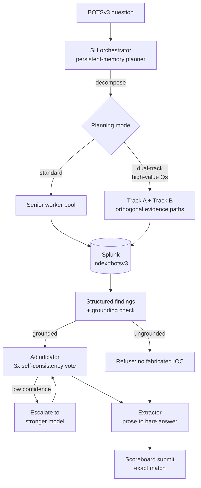

# README Storefront Implementation Plan

> **For agentic workers:** REQUIRED SUB-SKILL: Use superpowers:subagent-driven-development (recommended) or superpowers:executing-plans to implement this plan task-by-task. Steps use checkbox (`- [ ]`) syntax for tracking.

**Goal:** Turn this repo into a public, recruiter-facing storefront for an AI/agent-engineering audience — an honest leaderboard, a runnable offline scorer, real CI, and a README that survives an engineer actually reading the code.

**Architecture:** No agent-behavior code changes. Four additive pieces (`scripts/run_eval.py`, `.github/workflows/ci.yml`, `docs/ARCHITECTURE.md`, `docs/RUNBOOK.md`), one rewritten README, one lint config, and one destructive git-history purge that drops a 114 MB SQLite blob so `git clone` is viable. The scorer is the anti-drift mechanism: it recomputes the leaderboard from run artifacts and rewrites the README table in place, and CI fails if the README goes stale.

**Tech Stack:** Python 3.10+, pytest (154 existing tests), ruff, GitHub Actions, Mermaid (rendered natively by GitHub), `git filter-repo`.

## Global Constraints

- **Only real numbers.** Every figure in every document must be traceable to a file in `log/v1/` or `docs/scoreboard_result/`. No estimates, no rounding up, no aspirational claims.
- **Never trust `run_summary["score"]`.** `log/v1/run_1.1/run_summary.json` has stale `attempted: 4 / score: 0 / results: [4 rows]` keys from a later partial re-run. Verdicts come from `scoreboard_submissions.json`; cost comes from `run_summary["token_usage"]`. Both of those keys in run_1.1 are intact and match `docs/scoreboard_result/v1/v1.1.md`.
- **Scoring rule is exact-match, copied not reinvented:** `submitted.lower().strip() == official.lower().strip()` (per `agent/scoreboard_client.py:9`).
- **No `datasets/` → `data/` rename.** The directory stays `datasets/`. Only `datasets/evaluation/` is added.
- **Audience is an AI/agent-engineering hiring manager.** Lead with orchestration, evals, grounding, cost-per-run. SIEM is the domain that makes the benchmark hard, not the pitch.
- **Python 3.10+** (`str | None` unions already used in `agent/scoreboard_client.py:103`).
- **No new runtime dependencies.** `run_eval.py` is stdlib-only (`json`, `argparse`, `pathlib`, `re`).
- **Do not flip repo visibility to public.** The final task stops after the force-push; the human does the publish.

### Canonical figures (verified against the data — use these verbatim)

Tier table, v1.2, 56 questions:

| Tier | Solved / Total | Rate |
|------|:---:|:---:|
| 100 pt | 15 / 24 | 62.5% |
| 500 pt | 9 / 23 | 39.1% |
| 1000 pt | 2 / 9 | 22.2% |
| **Overall** | **26 / 56** | **46.4%** — 8000 / 22900 pts |

Version series:

| Version | Correct | Questions | Points | Cost | Source |
|---|---|---|---|---|---|
| v0 (single agent) | 20 | 56 (rescored) | 5700 | $7.73 | `log/baseline/v0_full_run.json`, `docs/scoreboard_result/v1/v1.1.md:19` |
| v1.0 | 20 | 58 | 5650 | $7.36 | `log/v1/run_1.0/run_summary.json`, `docs/scoreboard_result/v1/v1.1.md:17` |
| v1.1 | 26 | 56 | 8000 | $0.63 | `log/v1/run_1.1/scoreboard_submissions.json` + `token_usage` |
| v1.2 | 26 | 56 | 8000 | $31.36 | `log/v1/run_1.2/scoreboard_submissions.json` + `token_usage` |

Other verified facts: 11 of 56 v1.2 answers were ungrounded refusals; failed delegations went 1 (v1.1) → 62 (v1.2), which is the cost-blowup cause; Q332 = `cve-2017-16995` and Q333 = `cve-2017-9791`, both correct 1000-pointers; the two questions dropped from 58 → 56 are **Q1** (warmup, "what company makes this software") and **Q220** (answer is an AWS secret key not derivable from the dataset).

> ⚠️ **Known doc bug to fix in Task 7:** `docs/scoreboard_result/v1/v1.1.md:17` says the removed questions were "Q1 and Q207". The data says **Q1 and Q220**. Computed by diffing `log/baseline/v0_full_run.json` ids against `datasets/botsv3_questions.json` ids.

> ⚠️ **Scope note on deleting `log/baseline/`:** the decision to delete the broken baseline applies to **`log/baseline/gpt5.4mini_native_base_result.{json,log}`** only — that run scored 0 because the extractor hit an API 400 (`max_tokens` unsupported), so it is not a result. **`log/baseline/v0_full_run.{json,log}` must be kept**: it is the sole evidence for the v0 = 20/56 number in the headline progression.

---

## File Structure

**Created:**
- `pyproject.toml` — ruff config (`E,F,I`) + pytest `testpaths`. Nothing else; this is not a packaging change.
- `scripts/run_eval.py` — offline scorer. Single file, ~180 lines: load → score → summarize → render → write/check.
- `tests/test_run_eval.py` — pytest tests for the scorer's pure functions.
- `datasets/evaluation/versions.json` — hand-written historical series (v0…v1.2). Curated once; history does not change.
- `datasets/evaluation/leaderboard.json` — **generated** by `run_eval --write`. Never hand-edited.
- `.github/workflows/ci.yml` — ruff + pytest + leaderboard staleness check.
- `LICENSE` — MIT.
- `datasets/README.md` — BOTSv3 provenance and attribution.
- `docs/ARCHITECTURE.md` — v1.3 / Plan C system description.
- `docs/RUNBOOK.md` — clone → install → offline eval, plus the live-run path.

**Modified:**
- `README.md` — full rewrite.
- `.gitignore` — add SQLite checkpoint patterns.
- Various `agent/**/*.py` — ruff autofixes only (import order, unused imports). No behavior change.
- `docs/scoreboard_result/v1/v1.1.md:17` — Q207 → Q220 correction.

**Deleted:**
- `log/baseline/gpt5.4mini_native_base_result.json`, `log/baseline/gpt5.4mini_native_base_result.log`
- All tracked `*.sqlite`, `*.sqlite-wal`, `*.sqlite-shm` under `log/` (Task 10 purges them from history too).

---

### Task 1: Lint config and clean tree

**Files:**
- Create: `pyproject.toml`
- Modify: `.gitignore`
- Modify: `agent/**/*.py` (autofix only)
- Delete: `log/baseline/gpt5.4mini_native_base_result.json`, `log/baseline/gpt5.4mini_native_base_result.log`

**Interfaces:**
- Consumes: nothing.
- Produces: a green `ruff check .` and a green `pytest`, plus `testpaths = ["agent/v1/tests", "tests"]` so Task 2's tests are collected by a bare `pytest`. CI (Task 5) depends on both commands being green with no arguments.

- [ ] **Step 1: Confirm the baseline is currently green for tests and red for lint**

Run:
```bash
python3 -m pytest -q 2>&1 | tail -3
python3 -m pip install --quiet ruff && python3 -m ruff check agent/ 2>&1 | tail -2
```
Expected: pytest reports `154 passed`. ruff reports `Found 120 errors.` (Do not fix them by hand — Step 3 configures the rule set first.)

- [ ] **Step 2: Create `pyproject.toml`**

```toml
[tool.ruff]
line-length = 120
target-version = "py310"
exclude = ["datasets", "log", ".superpowers"]

[tool.ruff.lint]
# Deliberately narrow: pyflakes correctness (F), pycodestyle errors (E),
# import sorting (I). Style-only and opinionated rules are out of scope —
# this repo optimizes for agent-behavior correctness, not lint surface.
select = ["E", "F", "I"]

[tool.pytest.ini_options]
testpaths = ["agent/v1/tests", "tests"]
```

- [ ] **Step 3: Autofix, then inspect the remainder**

Run:
```bash
python3 -m ruff check --fix .
python3 -m ruff check .
```
Expected: the autofix clears the import-order (`I001`) and unused-import (`F401`) findings. Any remaining errors are `E501` long lines or genuine `F821`/`F841` findings — fix those by hand, one file at a time. Do **not** silence anything with `# noqa` unless the line is a deliberately long string literal.

- [ ] **Step 4: Verify no behavior changed**

Run: `python3 -m pytest -q`
Expected: `154 passed`. If the count dropped or anything fails, an autofix removed a used import — `git diff` the failing module and restore it.

- [ ] **Step 5: Stop tracking SQLite checkpoints**

Append to `.gitignore`:
```gitignore
# LangGraph checkpoint databases (regenerated per run; 114 MB in run_1.2)
*.sqlite
*.sqlite-wal
*.sqlite-shm
```

Run:
```bash
git rm --cached $(git ls-files '*.sqlite' '*.sqlite-wal' '*.sqlite-shm')
git rm log/baseline/gpt5.4mini_native_base_result.json log/baseline/gpt5.4mini_native_base_result.log
```
Expected: roughly 8 SQLite files untracked, 2 baseline files deleted. **Confirm `log/baseline/v0_full_run.json` is still tracked** — `git ls-files log/baseline` must still list it.

- [ ] **Step 6: Commit**

```bash
git add pyproject.toml .gitignore agent/
git commit -m "chore: add ruff config, clear lint findings, untrack sqlite checkpoints

- pyproject.toml pins ruff to E,F,I and sets pytest testpaths
- ruff --fix across agent/ (import order + unused imports, no behavior change)
- untrack *.sqlite/-wal/-shm; history purge follows separately
- delete the gpt5.4mini baseline: it scored 0 due to an extractor API 400,
  not model failure, so it is not a usable result"
```

---

### Task 2: `run_eval` scoring core

**Files:**
- Create: `scripts/run_eval.py`
- Create: `tests/test_run_eval.py`

**Interfaces:**
- Consumes: `pyproject.toml` `testpaths` from Task 1.
- Produces:
  - `is_correct(submitted: str | None, official: str | None) -> bool`
  - `load_rows(run_dir: Path) -> list[dict]`
  - `filter_rows(rows: list[dict], tier: int | None, ids: list[str] | None) -> list[dict]`
  - `summarize(rows: list[dict]) -> dict` returning `{"tiers": {100: {"correct": int, "total": int}, ...}, "correct": int, "total": int, "points_earned": int, "points_possible": int}`

  Task 3 consumes `summarize`'s return shape; Task 4 renders it.

- [ ] **Step 1: Write the failing tests**

Create `tests/test_run_eval.py`:

```python
"""Tests for the offline scorer.

The v1.2 run is the fixture: its numbers are published in the README, so if
these tests drift from the run artifacts, the storefront is lying.
"""
import sys
from pathlib import Path

import pytest

REPO = Path(__file__).resolve().parent.parent
sys.path.insert(0, str(REPO / "scripts"))

import run_eval  # noqa: E402


def test_is_correct_ignores_case_and_surrounding_whitespace():
    assert run_eval.is_correct("  CVE-2017-16995 ", "cve-2017-16995")


def test_is_correct_rejects_substring_match():
    # "E5-2676 v3" vs "E5-2676" was a real v1.1 miss (Q202). Exact match only.
    assert not run_eval.is_correct("E5-2676 v3", "E5-2676")


def test_is_correct_handles_missing_values():
    assert not run_eval.is_correct(None, "splunk")
    assert not run_eval.is_correct("splunk", None)


def test_recomputed_verdicts_match_the_recorded_ones():
    rows = run_eval.load_rows(REPO / "log" / "v1" / "run_1.2")
    assert len(rows) == 56
    for row in rows:
        assert run_eval.is_correct(row["submitted"], row["official"]) is bool(row["correct"]), row["number"]


def test_summarize_reproduces_the_published_v12_leaderboard():
    rows = run_eval.load_rows(REPO / "log" / "v1" / "run_1.2")
    summary = run_eval.summarize(rows)
    assert summary["correct"] == 26
    assert summary["total"] == 56
    assert summary["points_earned"] == 8000
    assert summary["points_possible"] == 22900
    assert summary["tiers"][100] == {"correct": 15, "total": 24}
    assert summary["tiers"][500] == {"correct": 9, "total": 23}
    assert summary["tiers"][1000] == {"correct": 2, "total": 9}


def test_filter_by_tier_selects_only_that_tier():
    rows = run_eval.load_rows(REPO / "log" / "v1" / "run_1.2")
    summary = run_eval.summarize(run_eval.filter_rows(rows, tier=1000, ids=None))
    assert (summary["correct"], summary["total"]) == (2, 9)


def test_filter_by_ids_is_case_insensitive_and_order_independent():
    rows = run_eval.load_rows(REPO / "log" / "v1" / "run_1.2")
    summary = run_eval.summarize(run_eval.filter_rows(rows, tier=None, ids=["q333", "Q332"]))
    assert (summary["correct"], summary["total"]) == (2, 2)


def test_filter_by_unknown_id_raises():
    rows = run_eval.load_rows(REPO / "log" / "v1" / "run_1.2")
    with pytest.raises(SystemExit):
        run_eval.filter_rows(rows, tier=None, ids=["Q999"])
```

- [ ] **Step 2: Run tests to verify they fail**

Run: `python3 -m pytest tests/test_run_eval.py -q`
Expected: FAIL — `ModuleNotFoundError: No module named 'run_eval'`.

- [ ] **Step 3: Write the scoring core**

Create `scripts/run_eval.py`:

```python
#!/usr/bin/env python3
"""Offline scorer for BOTSv3 agent runs.

Reads artifacts that are already in the repo — no API key, no Splunk, no LLM
calls. Verdicts are recomputed from the submitted/official answer pair using
the same exact-match rule as the live scoreboard, so this is a real
re-scoring, not a replay of a cached boolean.

Source-of-truth note: `run_summary.json`'s `score`/`correct`/`results` keys are
NOT trustworthy — run_1.1's were overwritten by a later partial re-run. Only
`scoreboard_submissions.json` (verdicts) and `run_summary["token_usage"]`
(cost) are used.
"""
from __future__ import annotations

import json
import sys
from pathlib import Path

REPO = Path(__file__).resolve().parent.parent
LOG_ROOT = REPO / "log" / "v1"
TIERS = (100, 500, 1000)


def is_correct(submitted: str | None, official: str | None) -> bool:
    """The scoreboard's rule, mirrored from agent/scoreboard_client.py:9."""
    if submitted is None or official is None:
        return False
    return submitted.lower().strip() == official.lower().strip()


def load_rows(run_dir: Path) -> list[dict]:
    path = run_dir / "scoreboard_submissions.json"
    if not path.exists():
        sys.exit(
            f"{path} not found. Only runs with a submissions file can be scored "
            f"(run_1.0 predates it)."
        )
    return json.loads(path.read_text())


def filter_rows(rows: list[dict], tier: int | None, ids: list[str] | None) -> list[dict]:
    selected = rows
    if tier is not None:
        selected = [r for r in selected if r["base_points"] == tier]
    if ids:
        wanted = {i.strip().upper().lstrip("Q") for i in ids}
        selected = [r for r in selected if str(r["number"]) in wanted]
        found = {str(r["number"]) for r in selected}
        missing = sorted(wanted - found)
        if missing:
            sys.exit(f"No such question(s) in this run: {', '.join('Q' + m for m in missing)}")
    if not selected:
        sys.exit("Filter matched no questions.")
    return selected


def summarize(rows: list[dict]) -> dict:
    tiers = {t: {"correct": 0, "total": 0} for t in TIERS}
    correct = points_earned = points_possible = 0
    for row in rows:
        hit = is_correct(row["submitted"], row["official"])
        points = row["base_points"]
        points_possible += points
        if hit:
            correct += 1
            points_earned += points
        if points in tiers:
            tiers[points]["total"] += 1
            tiers[points]["correct"] += int(hit)
    return {
        "tiers": {t: v for t, v in tiers.items() if v["total"]},
        "correct": correct,
        "total": len(rows),
        "points_earned": points_earned,
        "points_possible": points_possible,
    }
```

- [ ] **Step 4: Run tests to verify they pass**

Run: `python3 -m pytest tests/test_run_eval.py -q`
Expected: `8 passed`.

- [ ] **Step 5: Commit**

```bash
git add scripts/run_eval.py tests/test_run_eval.py
git commit -m "feat(eval): offline scorer core with exact-match rescoring

Recomputes verdicts from submitted/official pairs rather than trusting the
cached boolean, and reproduces the published v1.2 tier table under test."
```

---

### Task 3: Cost reporting and CLI

**Files:**
- Modify: `scripts/run_eval.py`
- Modify: `tests/test_run_eval.py`

**Interfaces:**
- Consumes: `summarize`, `load_rows`, `filter_rows` from Task 2.
- Produces:
  - `load_cost(run_dir: Path) -> dict` returning `{"models": {name: usd}, "total_usd": float}`
  - `latest_run() -> Path`
  - `render_report(run_dir: Path, summary: dict, cost: dict) -> str`
  - a working `python3 scripts/run_eval.py [--run] [--tier] [--ids]`

- [ ] **Step 1: Write the failing tests**

Append to `tests/test_run_eval.py`:

```python
def test_load_cost_matches_the_published_v12_total():
    cost = run_eval.load_cost(REPO / "log" / "v1" / "run_1.2")
    assert round(cost["total_usd"], 2) == 31.36
    assert "gpt-5.4-2026-03-05" in cost["models"]
    # Bookkeeping keys must not be reported as if they were models.
    assert "__total__" not in cost["models"]
    assert "__sh_cumulative__" not in cost["models"]


def test_load_cost_tolerates_a_run_without_token_usage():
    # run_1.0 predates cost tracking; the scorer must degrade, not crash.
    cost = run_eval.load_cost(REPO / "log" / "v1" / "run_1.0")
    assert cost["total_usd"] == 0.0
    assert cost["models"] == {}


def test_latest_run_picks_the_highest_version_not_the_alphabetical_last():
    assert run_eval.latest_run().name == "run_1.2"


def test_render_report_states_accuracy_points_and_cost():
    run_dir = REPO / "log" / "v1" / "run_1.2"
    text = run_eval.render_report(
        run_dir,
        run_eval.summarize(run_eval.load_rows(run_dir)),
        run_eval.load_cost(run_dir),
    )
    assert "26/56" in text
    assert "46.4%" in text
    assert "8000" in text
    assert "$31.36" in text
```

- [ ] **Step 2: Run tests to verify they fail**

Run: `python3 -m pytest tests/test_run_eval.py -q`
Expected: FAIL — `AttributeError: module 'run_eval' has no attribute 'load_cost'`.

- [ ] **Step 3: Implement cost, run selection, rendering, and the CLI**

Append to `scripts/run_eval.py`:

```python
def load_cost(run_dir: Path) -> dict:
    """Per-model USD from run_summary['token_usage'].

    Keys wrapped in double underscores are bookkeeping aggregates, not models.
    Runs predating cost tracking (run_1.0) simply report zero.
    """
    path = run_dir / "run_summary.json"
    if not path.exists():
        return {"models": {}, "total_usd": 0.0}
    usage = json.loads(path.read_text()).get("token_usage") or {}
    models = {
        name: entry.get("estimated_usd", 0.0)
        for name, entry in usage.items()
        if not name.startswith("__") and isinstance(entry, dict)
    }
    aggregate = usage.get("__total__")
    total = aggregate.get("estimated_usd") if isinstance(aggregate, dict) else None
    return {
        "models": models,
        "total_usd": float(total if total is not None else sum(models.values())),
    }


def latest_run() -> Path:
    """Highest-numbered scorable run_1.N directory, compared numerically."""
    runs = [p for p in LOG_ROOT.glob("run_1.*") if (p / "scoreboard_submissions.json").exists()]
    if not runs:
        sys.exit(f"No scorable runs under {LOG_ROOT}")
    return max(runs, key=lambda p: [int(n) for n in p.name.split("_")[1].split(".")])


def render_report(run_dir: Path, summary: dict, cost: dict) -> str:
    correct, total = summary["correct"], summary["total"]
    lines = [
        f"Run:      {run_dir.name}",
        f"Accuracy: {correct}/{total} = {100 * correct / total:.1f}%",
        f"Points:   {summary['points_earned']} / {summary['points_possible']}",
        "",
        "By tier:",
    ]
    for tier, stats in sorted(summary["tiers"].items()):
        tier_pct = 100 * stats["correct"] / stats["total"]
        lines.append(f"  {tier:>4} pt   {stats['correct']:>2}/{stats['total']:<2}  {tier_pct:5.1f}%")
    lines += ["", f"Cost:     ${cost['total_usd']:.2f} (whole run)"]
    for name, usd in sorted(cost["models"].items(), key=lambda kv: -kv[1]):
        lines.append(f"  {name:<28} ${usd:.4f}")
    return "\n".join(lines)


def main(argv: list[str] | None = None) -> int:
    import argparse

    parser = argparse.ArgumentParser(
        description="Score a BOTSv3 agent run offline. No API key, no Splunk, no LLM calls."
    )
    parser.add_argument("--run", help="Run directory name, e.g. run_1.1 (default: latest scorable run)")
    parser.add_argument("--tier", type=int, choices=TIERS, help="Score only this point tier")
    parser.add_argument("--ids", help="Comma-separated question ids, e.g. Q332,Q333")
    args = parser.parse_args(argv)

    run_dir = LOG_ROOT / args.run if args.run else latest_run()
    if not run_dir.exists():
        sys.exit(f"No such run: {run_dir}")
    rows = filter_rows(load_rows(run_dir), args.tier, args.ids.split(",") if args.ids else None)
    print(render_report(run_dir, summarize(rows), load_cost(run_dir)))
    return 0


if __name__ == "__main__":
    raise SystemExit(main())
```

- [ ] **Step 4: Run tests to verify they pass**

Run: `python3 -m pytest tests/test_run_eval.py -q`
Expected: `12 passed`.

- [ ] **Step 5: Verify the CLI by hand against known numbers**

Run:
```bash
python3 scripts/run_eval.py --tier 1000
python3 scripts/run_eval.py --ids Q332,Q333
python3 scripts/run_eval.py --run run_1.1
```
Expected: the first prints `2/9 = 22.2%` and `$31.36`; the second prints `2/2 = 100.0%`; the third prints `26/56 = 46.4%` and `$0.63`.

- [ ] **Step 6: Commit**

```bash
git add scripts/run_eval.py tests/test_run_eval.py
git commit -m "feat(eval): per-model cost reporting, run selection, and CLI"
```

---

### Task 4: Generated leaderboard + README sync

**Files:**
- Create: `datasets/evaluation/versions.json`
- Create: `datasets/evaluation/leaderboard.json` (generated — do not hand-write)
- Modify: `scripts/run_eval.py`
- Modify: `tests/test_run_eval.py`

**Interfaces:**
- Consumes: `summarize`, `load_cost`, `latest_run` from Tasks 2–3.
- Produces:
  - `load_versions() -> dict` (reads `versions.json`)
  - `render_leaderboard_markdown(summary: dict, versions: list[dict]) -> str`
  - `extract_block(readme_text: str) -> str | None`, `replace_block(readme_text: str, markdown: str) -> str`
  - `--write` (regenerates `leaderboard.json` and the README table) and `--check` (exit 1 if the README is stale)
  - The README markers `<!-- LEADERBOARD:START -->` / `<!-- LEADERBOARD:END -->` that Task 9 must place.

- [ ] **Step 1: Create the historical series**

Create `datasets/evaluation/versions.json`. Hand-written once and then frozen — it is history, and v0/v1.0 predate the artifacts `run_eval` can parse.

```json
{
  "_comment": "Hand-curated historical series. Sources are named per row. v1.1+ rows are verifiable with: python3 scripts/run_eval.py --run run_1.N",
  "versions": [
    {
      "version": "v0",
      "label": "single agent",
      "correct": 20,
      "questions": 56,
      "points": 5700,
      "cost_usd": 7.73,
      "source": "log/baseline/v0_full_run.json (rescored on the 56-question set)"
    },
    {
      "version": "v1.0",
      "label": "SH + Senior pool",
      "correct": 20,
      "questions": 58,
      "points": 5650,
      "cost_usd": 7.36,
      "source": "log/v1/run_1.0/run_summary.json"
    },
    {
      "version": "v1.1",
      "label": "+ Junior tier, cheaper Senior model",
      "correct": 26,
      "questions": 56,
      "points": 8000,
      "cost_usd": 0.63,
      "source": "log/v1/run_1.1/scoreboard_submissions.json + token_usage"
    },
    {
      "version": "v1.2",
      "label": "+ grounding guard, structured findings",
      "correct": 26,
      "questions": 56,
      "points": 8000,
      "cost_usd": 31.36,
      "source": "log/v1/run_1.2/scoreboard_submissions.json + token_usage"
    }
  ]
}
```

- [ ] **Step 2: Write the failing tests**

Append to `tests/test_run_eval.py`:

```python
def test_render_leaderboard_contains_both_tables_and_real_numbers():
    rows = run_eval.load_rows(REPO / "log" / "v1" / "run_1.2")
    markdown = run_eval.render_leaderboard_markdown(
        run_eval.summarize(rows), run_eval.load_versions()["versions"]
    )
    assert "| 1000 pt | 2 / 9 | 22.2% |" in markdown
    assert "| 100 pt | 15 / 24 | 62.5% |" in markdown
    assert "46.4%" in markdown
    assert "$0.63" in markdown   # v1.1 row
    assert "$31.36" in markdown  # v1.2 row


@pytest.mark.xfail(reason="README markers land in Task 9", strict=True)
def test_readme_leaderboard_block_is_in_sync():
    # Guards the exact invariant CI enforces with --check.
    rows = run_eval.load_rows(REPO / "log" / "v1" / "run_1.2")
    expected = run_eval.render_leaderboard_markdown(
        run_eval.summarize(rows), run_eval.load_versions()["versions"]
    )
    assert run_eval.extract_block((REPO / "README.md").read_text()) == expected.strip()


def test_replace_block_is_idempotent():
    original = "intro\n<!-- LEADERBOARD:START -->\nold\n<!-- LEADERBOARD:END -->\noutro\n"
    once = run_eval.replace_block(original, "new")
    assert run_eval.replace_block(once, "new") == once
    assert "old" not in once
    assert "intro" in once and "outro" in once
```

> The `xfail` marker is removed in Task 9 Step 5, once the README carries the markers. `strict=True` means it will also fail loudly if it starts passing early — that is the point.

- [ ] **Step 3: Run tests to verify they fail**

Run: `python3 -m pytest tests/test_run_eval.py -q`
Expected: FAIL — `AttributeError: module 'run_eval' has no attribute 'render_leaderboard_markdown'`.

- [ ] **Step 4: Implement rendering, writing, and checking**

Add to `scripts/run_eval.py`, above `main`. Also add `import re` to the imports at the top of the file:

```python
EVAL_DIR = REPO / "datasets" / "evaluation"
README = REPO / "README.md"
BLOCK_RE = re.compile(
    r"(?<=<!-- LEADERBOARD:START -->\n).*?(?=\n<!-- LEADERBOARD:END -->)", re.DOTALL
)


def load_versions() -> dict:
    return json.loads((EVAL_DIR / "versions.json").read_text())


def render_leaderboard_markdown(summary: dict, versions: list[dict]) -> str:
    correct, total = summary["correct"], summary["total"]
    lines = ["| Tier | Solved / Total | Rate |", "|------|:---:|:---:|"]
    for tier, stats in sorted(summary["tiers"].items()):
        rate = 100 * stats["correct"] / stats["total"]
        lines.append(f"| {tier} pt | {stats['correct']} / {stats['total']} | {rate:.1f}% |")
    lines.append(
        f"| **Overall** | **{correct} / {total}** | **{100 * correct / total:.1f}%** "
        f"— {summary['points_earned']} / {summary['points_possible']} pts |"
    )
    lines += ["", "| Version | Correct | Points | Cost | Notes |", "|---|:---:|:---:|:---:|---|"]
    for v in versions:
        lines.append(
            f"| {v['version']} | {v['correct']} / {v['questions']} | {v['points']} | "
            f"${v['cost_usd']:.2f} | {v['label']} |"
        )
    return "\n".join(lines)


def extract_block(readme_text: str) -> str | None:
    match = BLOCK_RE.search(readme_text)
    return match.group(0).strip() if match else None


def replace_block(readme_text: str, markdown: str) -> str:
    if not BLOCK_RE.search(readme_text):
        sys.exit("README.md is missing the <!-- LEADERBOARD:START/END --> markers.")
    return BLOCK_RE.sub(lambda _: markdown.strip(), readme_text)


def write_artifacts(run_dir: Path, summary: dict, cost: dict) -> None:
    EVAL_DIR.mkdir(parents=True, exist_ok=True)
    (EVAL_DIR / "leaderboard.json").write_text(
        json.dumps(
            {
                "_generated_by": "scripts/run_eval.py --write — do not hand-edit",
                "run": run_dir.name,
                "overall": {"correct": summary["correct"], "total": summary["total"]},
                "points": {
                    "earned": summary["points_earned"],
                    "possible": summary["points_possible"],
                },
                "tiers": summary["tiers"],
                "cost": cost,
                "versions": load_versions()["versions"],
            },
            indent=2,
        )
        + "\n"
    )
    markdown = render_leaderboard_markdown(summary, load_versions()["versions"])
    README.write_text(replace_block(README.read_text(), markdown))
    print(f"Wrote {EVAL_DIR / 'leaderboard.json'} and refreshed the README leaderboard block.")


def check_artifacts(summary: dict) -> int:
    expected = render_leaderboard_markdown(summary, load_versions()["versions"]).strip()
    if extract_block(README.read_text()) != expected:
        print(
            "README leaderboard is stale. Run: python3 scripts/run_eval.py --write",
            file=sys.stderr,
        )
        return 1
    print("README leaderboard is in sync.")
    return 0
```

Then replace the body of `main` after the existing `--ids` argument with:

```python
    parser.add_argument("--write", action="store_true", help="Regenerate leaderboard.json and the README table")
    parser.add_argument("--check", action="store_true", help="Exit 1 if the README leaderboard is stale (CI)")
    args = parser.parse_args(argv)

    if args.write and args.check:
        sys.exit("--write and --check are mutually exclusive.")
    if (args.tier or args.ids) and (args.write or args.check):
        sys.exit("--write/--check operate on the full run; drop --tier/--ids.")

    run_dir = LOG_ROOT / args.run if args.run else latest_run()
    if not run_dir.exists():
        sys.exit(f"No such run: {run_dir}")
    rows = filter_rows(load_rows(run_dir), args.tier, args.ids.split(",") if args.ids else None)
    summary = summarize(rows)
    cost = load_cost(run_dir)

    if args.write:
        write_artifacts(run_dir, summary, cost)
        return 0
    if args.check:
        return check_artifacts(summary)

    print(render_report(run_dir, summary, cost))
    return 0
```

- [ ] **Step 5: Generate the artifacts and run the tests**

Run:
```bash
python3 scripts/run_eval.py --write   # expect: "README.md is missing the ... markers." until Task 9
python3 -m pytest tests/test_run_eval.py -q
```
Expected: `--write` exits with the missing-markers message (Task 9 supplies them); pytest reports `14 passed, 1 xfailed`.

- [ ] **Step 6: Commit**

```bash
git add scripts/run_eval.py tests/test_run_eval.py datasets/evaluation/versions.json
git commit -m "feat(eval): generated leaderboard + README sync via --write/--check

The README table is generated from run artifacts and CI fails on drift, so
the published numbers cannot silently diverge from the logs."
```

---

### Task 5: CI workflow

**Files:**
- Create: `.github/workflows/ci.yml`

**Interfaces:**
- Consumes: green `ruff check .` and `pytest` from Task 1; `--check` from Task 4.
- Produces: a workflow named `ci` whose badge URL is `https://github.com/lee1613/SIEM-Automation/actions/workflows/ci.yml/badge.svg`, used by Task 9.

- [ ] **Step 1: Create the workflow**

```yaml
name: ci

on:
  push:
    branches: [main]
  pull_request:

jobs:
  test:
    runs-on: ubuntu-latest
    steps:
      - uses: actions/checkout@v4
      - uses: actions/setup-python@v5
        with:
          python-version: "3.11"
      - name: Install lint + test tooling
        # The agent's runtime deps are not needed: the unit tests and the
        # offline scorer are stdlib-only. Installing agent/requirements.txt
        # here would pull LLM SDKs for no benefit.
        run: pip install ruff pytest
      - name: Lint
        run: ruff check .
      - name: Test
        run: pytest -q
      - name: Leaderboard is in sync with the run artifacts
        run: python3 scripts/run_eval.py --check
```

- [ ] **Step 2: Verify each CI step locally before pushing**

Run:
```bash
python3 -m ruff check .
python3 -m pytest -q
python3 scripts/run_eval.py --check
```
Expected: ruff clean; `166 passed, 1 xfailed` (154 existing + 12 new); `--check` still reports the missing-markers error until Task 9. **Do not push this workflow until Task 9 is done** — the `--check` step would fail on an unmarked README.

- [ ] **Step 3: Verify the test dependency claim**

Run: `python3 -m pytest -q --collect-only 2>&1 | tail -3`
Expected: collection succeeds without importing any LLM SDK. If collection errors on a missing third-party import, add that package to the CI `pip install` line and note why in a comment.

- [ ] **Step 4: Commit**

```bash
git add .github/workflows/ci.yml
git commit -m "ci: ruff + pytest + leaderboard staleness check"
```

---

### Task 6: License and dataset provenance

**Files:**
- Create: `LICENSE`
- Create: `datasets/README.md`

**Interfaces:**
- Consumes: nothing.
- Produces: the license name and attribution text that Task 9's README footer links to.

- [ ] **Step 1: Add the MIT license**

Create `LICENSE` with the verbatim OSI MIT text, `Copyright (c) 2026 Lee023`. Do not paraphrase it.

- [ ] **Step 2: Add dataset provenance**

Create `datasets/README.md`:

```markdown
# Datasets

## BOTSv3 (Boss of the SOC v3)

The contents of `botsv3/` — questions, answers, hints, and lookup tables — are
Splunk's **Boss of the SOC v3** dataset, published by Splunk at
<https://github.com/splunk/botsv3>. They are redistributed here under their
original license for benchmarking purposes; they are **not** covered by this
repository's MIT license, which applies only to the code.

`botsv3_questions.json` (56 questions) is the runner's working set. It omits
two of the 58 official questions:

| Omitted | Why |
|---|---|
| Q1 | Warmup ("which company makes this software?" → `splunk`). No investigation required, so scoring it inflates accuracy. |
| Q220 | The answer is an AWS secret access key that is not derivable from the dataset. Unanswerable by any agent working from the logs. |

Both removals lower the reported score rather than raise it: Q1 is a free
point, and Q220 was already a miss.

`ctf_answers.csv` contains Splunk's planted test credentials (e.g. an
AWS-secret-key-shaped string for Q220). These are fabricated CTF artifacts
published by Splunk, not live secrets. Automated secret scanners may flag
them.
```

- [ ] **Step 3: Verify the omitted-question claim still holds**

Run:
```bash
python3 -c "
import json
v0 = {x['id'] for x in json.load(open('log/baseline/v0_full_run.json'))['results']}
cur = {q['id'] for q in json.load(open('datasets/botsv3_questions.json'))}
print(sorted(v0 - cur))"
```
Expected: `['Q1', 'Q220']`. If this prints anything else, correct `datasets/README.md` to match the data.

- [ ] **Step 4: Commit**

```bash
git add LICENSE datasets/README.md
git commit -m "docs: MIT license and BOTSv3 provenance/attribution"
```

---

### Task 7: `docs/ARCHITECTURE.md`

**Files:**
- Create: `docs/ARCHITECTURE.md`
- Modify: `docs/scoreboard_result/v1/v1.1.md:17`

**Interfaces:**
- Consumes: `docs/version_architecture/v1/v1.3.md` as source material.
- Produces: the Mermaid diagram block that Task 9 reuses in condensed form.

- [ ] **Step 1: Read the source material**

Read `docs/version_architecture/v1/v1.3.md` in full, plus the "what changed" section of `docs/version_architecture/v1/v1.2.md`. The architecture doc describes **v1.3 / Plan C** — the code as it exists now.

- [ ] **Step 2: Write `docs/ARCHITECTURE.md`**

Required sections, in order:

1. **Status banner**, verbatim:
   > **v1.3 (Plan C) is the current architecture. The published metrics are from the v1.2 full run** — v1.3's adjudication, escalation, dual-track planning, and self-consistency sampling are shipped and unit-tested but not yet benchmarked end to end. Numbers here are never extrapolated to unrun versions.
2. **Three-tier layout** — SH orchestrator (`agent/v1/orchestrator.py`), Senior/Junior worker pool (`agent/v1/splunk_subagent.py`), Extractor (`agent/v1/extractor.py`). One paragraph each: responsibility, model, and why the tier exists. Cite file paths.
3. **The Mermaid diagram** (this exact block — Task 9 reuses it):

````markdown

````

4. **Control mechanisms** — one subsection each for the grounding guard, adjudication + 3× sampling, escalation, and dual-track planning. Each states what it does, which file implements it, and its observed cost/benefit from `docs/version_architecture/v1/v1.2.md` and `v1.3.md`.
5. **Run artifacts** — what a run writes under `log/v1/run_1.N/` (`SH/`, `Senior Splunk/`, `Junior Splunk/`, `Extractor/`, `timeline.md`, `run_summary.json`, `scoreboard_submissions.json`) and which of those `scripts/run_eval.py` consumes. Include the warning that `run_summary["score"]` can be stale (run_1.1 was overwritten by a partial re-run) and that verdicts therefore come from `scoreboard_submissions.json`.
6. **Known limitations** — the 1000 pt tier at 2/9; the v1.2 failed-delegation blowup (1 → 62 failed delegations, $0.63 → $31.36); extractor over-trimming.

- [ ] **Step 3: Fix the Q207 error in the v1.1 result doc**

In `docs/scoreboard_result/v1/v1.1.md:17`, change `(Q1 and Q207 removed from runner before this run)` to `(Q1 and Q220 removed from runner before this run)`. Verified in Task 6 Step 3.

- [ ] **Step 4: Verify every file path cited in the doc exists**

Run:
```bash
grep -oE '`(agent|docs|scripts|log)/[^`]+`' docs/ARCHITECTURE.md | tr -d '`' | sort -u | while read -r p; do [ -e "$p" ] || echo "MISSING: $p"; done
```
Expected: no output.

- [ ] **Step 5: Commit**

```bash
git add docs/ARCHITECTURE.md docs/scoreboard_result/v1/v1.1.md
git commit -m "docs: ARCHITECTURE.md for v1.3/Plan C; fix Q207->Q220 in v1.1 result doc"
```

---

### Task 8: `docs/RUNBOOK.md`

**Files:**
- Create: `docs/RUNBOOK.md`

**Interfaces:**
- Consumes: the `run_eval` CLI from Tasks 2–4.
- Produces: the quick-start commands Task 9's README links to.

- [ ] **Step 1: Write `docs/RUNBOOK.md`**

Required sections:

1. **Offline evaluation (no API key, no Splunk)** — the path a reviewer actually takes:
   ```bash
   git clone https://github.com/lee1613/SIEM-Automation.git
   cd SIEM-Automation
   python3 scripts/run_eval.py                 # full latest run
   python3 scripts/run_eval.py --tier 1000     # the hard tier: 2/9
   python3 scripts/run_eval.py --ids Q332,Q333 # the two CVE hits
   python3 scripts/run_eval.py --run run_1.1   # 26/56 for $0.63
   ```
   State the requirement (Python 3.10+, stdlib only) and paste the real output of `--tier 1000` so a reader knows what success looks like.
2. **Running the tests** — `pip install pytest ruff && pytest -q && ruff check .`
3. **Live runs (requires Splunk + API keys)** — prerequisites, pointer to `docs/BOTS_V3_SETUP.md` for the Splunk install and `agent/.env.example` for keys, and the smoke-test invocation `python agent/v1/run_all_v1.py --ids Q216,Q217,Q224,Q328,Q329`. Include the cost warning: a full 56-question run cost **$31.36** on v1.2; smoke tests are 5 questions and write to `log/temp/`.
4. **Regenerating the leaderboard after a run** — `python3 scripts/run_eval.py --write`, and that CI enforces it with `--check`.

- [ ] **Step 2: Execute every command in the runbook**

Run each offline block exactly as written and paste the real output into the doc. Any command that errors is a doc bug — fix the doc, not the reader's expectations.

- [ ] **Step 3: Commit**

```bash
git add docs/RUNBOOK.md
git commit -m "docs: RUNBOOK with verified offline-eval and live-run paths"
```

---

### Task 9: README rewrite

**Files:**
- Modify: `README.md` (full rewrite)
- Modify: `tests/test_run_eval.py` (remove the xfail marker)

**Interfaces:**
- Consumes: everything from Tasks 2–8.
- Produces: the public storefront. Must contain `<!-- LEADERBOARD:START -->` / `<!-- LEADERBOARD:END -->` or `--write`/`--check` fail.

- [ ] **Step 1: Write the README in this section order**

**1. Hero.** Title, one-line pitch aimed at an agent-engineering reader — e.g. *"A three-tier LLM agent that investigates real SOC incidents in Splunk, benchmarked on Boss of the SOC v3. 26/56 (46.4%), with every trajectory logged."* Then three badges:
```markdown
[](https://github.com/lee1613/SIEM-Automation/actions/workflows/ci.yml)
-blue)

```

**2. What this is** — 3–4 sentences. The benchmark is 56 real forensic questions over a multi-sourcetype Splunk index; the agent plans, delegates, searches, and self-checks. Name the honest framing: *a single agent scored 20/56; the multi-agent pipeline scores 26/56, and the 1000-point tier is still the frontier at 2/9.*

**3. Leaderboard** — the marker block, with generated content between the markers:
```markdown
<!-- LEADERBOARD:START -->
<!-- LEADERBOARD:END -->
```
Below the block, one line: *Regenerate with `python3 scripts/run_eval.py --write`; CI fails if this table drifts from `log/v1/`.*

**4. Architecture** — the Mermaid diagram from Task 7 Step 2, plus 4–5 bullets on the control mechanisms (grounding guard, adjudication, escalation, dual-track). Link to `docs/ARCHITECTURE.md`.

**5. Agent trajectory logs** — two examples, each ≤10 lines, each linking to `log/v1/run_1.2/timeline.md` and `docs/scoreboard_result/v1/v1.2.md`:
   - **A 1000-point hit:** Q332 → `cve-2017-16995` and Q333 → `cve-2017-9791`. Show the reasoning path (sourcetype identification → SPL → CVE), quoted from `timeline.md`.
   - **An honest refusal:** Q303, where the agent returned *"The password is not provided in the context"* and was scored **wrong**. Frame it exactly: in a SOC, a confident wrong IOC costs an analyst hours of chasing; the grounding guard makes the agent decline instead of guessing. **11 of 56 answers were refusals rather than guesses** (`grounded: false` in `run_summary.json`). State plainly that this costs points on the benchmark and is a deliberate trade.

**6. Quick start** — the offline path, copy-pasteable, with real output:
```bash
python3 scripts/run_eval.py --tier 1000
```
No API key, no Splunk, Python 3.10+. Link to `docs/RUNBOOK.md`.

**7. Lessons learned** — 5 entries, 1–3 lines each, all traceable:
   - *Cost is an architecture bug, not a billing line.* v1.1 and v1.2 both scored 26/56; v1.1 cost $0.63, v1.2 cost $31.36. The delta is failed delegations: 1 → 62. A retry path with no cap turned a held score into a 50× bill.
   - *Refusal is a feature.* The grounding guard trades benchmark points for trustworthy output; 11 of 56 answers declined rather than fabricate.
   - *The frontier is multi-hop.* 100 pt: 62.5%. 1000 pt: 22.2%. The failures are chained-inference questions, not lookup questions.
   - *The scoring path needs the same rigor as the agent.* `run_summary.json`'s score keys were silently overwritten by a partial re-run; the scorer now derives verdicts from submission records instead.
   - *Extractor over-trimming.* Correct investigations lost points on answer formatting — cite a specific case from `docs/scoreboard_result/v1/v1.2.md`.

**8. Repo layout** — a short table: `agent/` (the pipeline), `datasets/` (BOTSv3 + evaluation artifacts), `docs/` (architecture and per-version results), `log/` (full trajectory evidence for every scored run), `scripts/` (offline scorer), `CLAUDE.md` / `AGENTS.md` (the agent-assisted development workflow used to build this).

**9. Next** — undated, no promises, phrased as open problems: cap replan rounds for high-value questions; a portable replay view of a run's trajectory; close the 1000 pt gap. No dates, no checkboxes, no "Phase 2".

**10. License and attribution** — MIT for the code; BOTSv3 is Splunk's, link `datasets/README.md`.

- [ ] **Step 2: Generate the leaderboard block**

Run: `python3 scripts/run_eval.py --write`
Expected: `Wrote .../leaderboard.json and refreshed the README leaderboard block.` Open `README.md` and confirm the table now sits between the markers and shows `| 1000 pt | 2 / 9 | 22.2% |`.

- [ ] **Step 3: Verify the sync check passes**

Run: `python3 scripts/run_eval.py --check`
Expected: `README leaderboard is in sync.`

- [ ] **Step 4: Verify every relative link resolves**

Run:
```bash
grep -oE '\]\(([^)h][^)]*)\)' README.md | sed -E 's/^\]\(|\)$//g' | cut -d'#' -f1 | sort -u | while read -r p; do [ -z "$p" ] || [ -e "$p" ] || echo "BROKEN: $p"; done
```
Expected: no output.

- [ ] **Step 5: Remove the xfail marker and run the full suite**

Delete the `@pytest.mark.xfail(reason="README markers land in Task 9", strict=True)` line above `test_readme_leaderboard_block_is_in_sync` in `tests/test_run_eval.py`.

Run: `python3 -m pytest -q && python3 -m ruff check .`
Expected: `167 passed`, no xfail, ruff clean.

- [ ] **Step 6: Commit**

```bash
git add README.md datasets/evaluation/leaderboard.json tests/test_run_eval.py
git commit -m "docs: rewrite README as the project storefront

Generated leaderboard, Mermaid architecture, two real trajectories (a 1000pt
CVE hit and a grounding-guard refusal), and lessons drawn from the run logs."
```

---

### Task 10: History purge, branch cleanup, push

**Files:**
- Rewrites git history. No working-tree file changes.

**Interfaces:**
- Consumes: the `.gitignore` and untracking from Task 1 — **do not start this task until Tasks 1–9 are committed**, or the rewrite must be redone.
- Produces: a `.git` small enough to clone, `main` as the branch name, and a pushed remote. **Stops before making the repo public.**

> ⚠️ This task rewrites published history and force-pushes. Every step is ordered so a mistake stays recoverable from the `pre-purge-backup` tag until the force-push.

- [ ] **Step 1: Tag a backup and record the starting size**

```bash
git tag pre-purge-backup
du -sh .git
git count-objects -vH | grep size-pack
```
Expected: ~766 MB. Write the number down; Step 5 compares against it.

- [ ] **Step 2: Confirm the working tree is clean and tests are green**

```bash
git status --short
python3 -m pytest -q
```
Expected: no output from `git status`; `167 passed`. Do not proceed otherwise.

- [ ] **Step 3: Purge the blobs from history**

```bash
python3 -m pip install --quiet git-filter-repo
python3 -m git_filter_repo --force \
  --path-glob '*.sqlite' \
  --path-glob '*.sqlite-wal' \
  --path-glob '*.sqlite-shm' \
  --path log/baseline/gpt5.4mini_native_base_result.json \
  --path log/baseline/gpt5.4mini_native_base_result.log \
  --invert-paths
```
Expected: filter-repo reports the rewrite and completes. It removes the `origin` remote by design — Step 6 restores it.

- [ ] **Step 4: Verify the right things survived**

```bash
git log --oneline | head -5
git ls-files log/baseline
test -f log/v1/run_1.2/scoreboard_submissions.json && echo "submissions OK"
test -f log/v1/run_1.2/timeline.md && echo "timeline OK"
git ls-files '*.sqlite' | wc -l
```
Expected: history intact; `log/baseline/v0_full_run.json` and `.log` still listed while the gpt5.4mini pair is gone; both `OK` lines print; `0` sqlite files.

- [ ] **Step 5: Verify the size drop and that everything still works**

```bash
git reflog expire --expire=now --all && git gc --prune=now --aggressive
du -sh .git
python3 -m pytest -q
python3 scripts/run_eval.py --check
```
Expected: `.git` well under 100 MB (from ~766 MB); `167 passed`; leaderboard in sync. If `run_eval` now fails, a needed artifact was purged — restore from `pre-purge-backup` and narrow the path globs.

- [ ] **Step 6: Rename the branch and delete the stale ones**

```bash
git remote add origin https://github.com/lee1613/SIEM-Automation.git
git branch -m jy main
git branch -D judge
git worktree list          # find the worktree holding the old `main`
```
If a worktree holds the old `main`, remove it with `git worktree remove <path>` before deleting that branch. Run `git log --oneline main | head` to confirm it holds nothing wanted, then `git branch -D main` if it still exists under that name.

- [ ] **Step 7: Push**

```bash
git push --force origin main
git push origin --delete jy judge
```
Expected: `main` appears on the remote with the rewritten history.

- [ ] **Step 8: Set the default branch, description, topics, and confirm CI**

```bash
gh repo edit lee1613/SIEM-Automation --default-branch main \
  --description "Multi-agent LLM pipeline for SOC incident investigation, benchmarked on Splunk Boss of the SOC v3 (26/56)" \
  --add-topic llm-agents --add-topic multi-agent --add-topic siem --add-topic splunk --add-topic evals
gh run watch
```
Expected: the `ci` workflow completes green (ruff, pytest, leaderboard check).

- [ ] **Step 9: Stop and hand off**

Report to the human:
- old vs new `.git` size,
- the CI run URL and its status,
- the rendered README URL,
- the exact command to publish: `gh repo edit lee1613/SIEM-Automation --visibility public --accept-visibility-change-consequences`.

**Do not run the publish command.** Also warn that GitHub push protection may flag the Q220 AWS-key-shaped string in `datasets/botsv3/ctf_answers.csv`; if it does, allowlist it as a published CTF test credential (documented in `datasets/README.md`) rather than scrubbing the dataset.

---

## Self-Review

**Spec coverage.** All 13 locked decisions map to tasks: purge → 1 + 10; public/branch rename → 10; no `datasets/`→`data/` rename → honored throughout (Task 4 writes to `datasets/evaluation/`); generated leaderboard + CI drift check → 4 + 5; ruff narrow rule set → 1; v0→v1 progression with no fabricated baseline → 4 (`versions.json`) + 9; v1.3 architecture with v1.2 metrics → 7; both trajectories → 9; MIT + attribution → 6; Mermaid + badges → 7 + 9; agent-engineering voice → 9; `run_eval` flag set with no `--live` → 3 + 4; undated Next section → 9; stop before publishing → 10 Step 9. The three loose ends: `main`/`judge` deleted (10 Step 6), broken baseline deleted (1 Step 5, 10 Step 3), 58→56 explained (6 Step 2).

**Placeholder scan.** No TBDs. Every code step carries complete code; every doc step names required sections and exact content; every verification step gives a command and its expected output. Tasks 7–9 specify structure and required content rather than full prose — the source files must be read at execution time, and the verification steps are mechanical.

**Type consistency.** `summarize` returns the same dict shape wherever consumed (Tasks 2, 3, 4). `load_cost` returns `{"models", "total_usd"}` consistently. `render_leaderboard_markdown(summary, versions)` takes the `versions` **list**, and every caller passes `load_versions()["versions"]`. `render_report(run_dir, summary, cost)` keeps that argument order in its test and in `main`. The marker strings match across `run_eval.py`, the tests, and the README.

**Deviation flagged for the human:** the "delete `log/baseline/` entirely" instruction is implemented as deleting only the two `gpt5.4mini_native_base_result.*` files. `v0_full_run.json` is the sole source of the v0 = 20/56 figure the locked headline depends on, so deleting it would break that decision. Say the word and it goes — but the progression claim goes with it.
